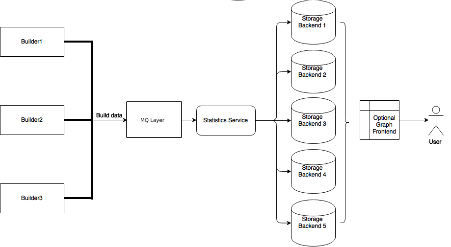

.. _stats-service:

Statistics Service
==================

The statistic service (or stats service) is implemented in :mod:`buildbot.statistics.stats_service`.
Please see :bb:cfg:`stats-service` for more information.

Here is a diagram demonstrating the working of the stats service:

Stats Service
-------------

.. py:class:: buildbot.statistics.stats_service.StatsService

   An instance of this class functions as a :class:`BuildbotService`.
   The instance of the running service is initialized in the master configuration file (see :bb:cfg:`stats-service` for more information).
   The running service is accessible everywhere in Buildbot via the :class:`BuildMaster`.
   The service is available at ``self.master.namedServices['<service-name>']``.
   It takes the following intialization arguments:

   ``storage_backends``
     A list of storage backends.
     These are instance of subclasses of :class:`StatsStorageBase`.
   ``name``
     (str) The name of this service.
     This name can be used to access the running instance of this service using ``self.master.namedServices[name]``.

   Please see :bb:cfg:`stats-service` for examples.

   .. py:method:: checkConfig(self, storage_backends)

      ``storage_backends``
        A list of storage backends.

      This method is called automatically to verify that the list of storage backends contains instances of subclasses of :class:`StatsStorageBase`.

   .. py:method:: reconfigService(self, storage_backends)

      ``storage_backends``
        A list of storage backends.

      This mehtod is called automatically to reconfigure the running service.

   .. py:method:: registerConsumers(self)

      Internal method for this class called to register all consumers (methods from Capture classes) to the MQ layer.

   .. py:method:: stopService(self)

      Internal method for this class to stop the stats service and clean up.

   .. py:method:: removeConsumers(self)

      Internal method for this class to stop and remove consumers from the MQ layer.

   .. py:method:: yieldMetricsValue(self, data_name, post_data, buildid)

      ``data_name``
        (str) The name of the data being sent or storage.
      ``post_data``
        A dictionary of key value pair that is sent for storage.
      ``buildid``
        The integer build id of the current build.
        Obtainable in all ``BuildSteps``.

      This method should be called to post data that is not generated and stored as build-data in the database.
      This method generates the ``stats-yield-data`` event to the mq layer which is then consumed in :py:class:`postData`.

.. _storage-backend:

Storage backends
----------------

Storage backends are responsible for storing any statistics/data sent to them.
A storage backend will generally be some sort of a database-server running on a machine.
.. note:: This machine may be different from the one running :class:`BuildMaster`

Data is captured according to the master config file and then, is sent to each of the storage backends provided by the master configuration (see :bb:cfg:`stats-service`).

Each storage backend has a Python client defined as part of :mod:`buildbot.statistics.storage_backends` to aid in posting data by :class:`StatsService`.

Currently, only `InfluxDB <http://influxdb.com>`_ is supported as a storage backend.

.. py:class:: buildbot.statistis.storage_backends.base.StatsStorageBase

   A abstract class for all storage services.
   It cannot be directly initialized - it would raise a ``TypeError`` otherwise.

   .. py:method:: thd_postStatsValue(self, post_data, series_name, context)

      ``post_data``
        A dict of key-value pairs that is sent for storage.
        The keys of this dict can be thought of as columns in a database and the value is the data stored for that column.
      ``series_name``
        (str) The name of the time-series for this statistic.
      ``context``
        (Optional) Any other contextual information about the data.
        It is a dict of key-value pairs.

      An abstract method that needs to be implemented by every child class of this class.
      Not doing so will result result in a ``TypeError`` when starting Buildbot.

.. py:class:: buildbot.statistics.storage_backends.influxdb_client.InfluxStorageService

   `InfluxDB <http://influxdb.com>`_ is a distributed, time series database that employs a key-value pair storage system.

   This class is a Buildbot client to the InfluxDB storage backend.
   It is available in the configuration as ``statistics.InfluxStorageService``.
   It takes the following initialization arguments:

   ``url``
     (str) The URL where the service is running.
   ``port``
     (int) The port on which the service is listening.
   ``user``
     (str) Username of a InfluxDB user.
   ``password``
     (str) Password for ``user``.
   ``db``
     (str) The name of database to be used.
   ``captures``
     A list of instances of subclasses of :py:class:`Capture`.
     This tells which stats are to be stored in this storage backend.
   ``name=None``
     (Optional) (str) The name of this storage backend.

   .. py:method:: thd_postStatsValue(self, post_data, series_name, context={})

      ``post_data``
        A dict of key-value pairs that is sent for storage.
        The keys of this dict can be thought of as columns in a database and the value is the data stored for that column.
      ``series_name``
        (str) The name of the time-series for this statistic.
      ``context``
        (Optional) Any other contextual information about the data.
        It is a dict of key-value pairs.

      This method constructs a dictionary of data to be sent to InfluxDB in the proper format and sends the data to the influxDB instance.

Capture Classes
---------------

Capture classes are used for declaring which data needs to captured and sent to storage backends for storage.

.. py:class:: buildbot.statistics.capture.Capture

   This is the abstract base class for all capture classes.
   Not to be used directly.
   Initlized with the following parameters:

   ``routingKey``
     (tuple) The routing key to be used by :class:`StatsService` to register consumers to the MQ layer for the subclass of this class.
   ``callback``
     The callback registered with the MQ layer for the consumer of a subclass of this class.
     Each subclass must provide a default callback for this purpose.

   .. py:method:: _defaultContext(self, msg):

      A method for providing default context to the storage backends.

   .. py:method:: consume(self, routingKey, msg):

      This is an abstract method - each subclass of this class should implement its own consume method.
      If not, then the subclass can't be instantiated.
      The consume method, when called (from the mq layer), receives the following arguments:

      ``routingKey``
        The routing key which was registered to the MQ layer.
        Same as the ``routingKey`` provided to instantiate this class.
      ``msg``
        The message that was sent by the producer.

   .. py:method:: _store(self, post_data, series_name, context):

      This is an abstract method of this class.
      It must be implemented by all subclasses of this class.
      It takes the following arguments:

      ``post_data``
        (dict) The key-value pair being sent to the storage backend.
      ``series_name``
        (str) The name of the series to which this data is stored.
      ``context``
        (dict) Any additional information pertaining to data being sent.

.. py:class:: buildbot.statistics.capture.CapturePropertyBase

   This is a base class for both :class:`CaptureProperty` and :class:`CapturePropertyAllBuilders` and abstracts away much of the common functionaltiy between the two classes.
   Cannot be initialzed directly as it contains an abstract method and raises ``TypeError`` if tried.
   It is intialized with the following arguments:

   ``property_name``
     (str) The name of property needed to be recorded as a statistic.
     This can be a regular expression if ``regex=True`` (see below).
   ``callback=None``
     The callback function that is used by ``CaptureProperty.consumer`` to post-process data before formatting it and sending it to the appropriate storage backends.
     A default callback needs to be prois provided for this.

     The default callback:

       .. py:function:: default_callback(props, property_name)

       It returns property value for ``property_name``.
       It receives the following arguments:

       ``props``
         A dictionary of all build properties.
       ``property_name``
         (str) Name of the build property to return.

   ``regex=False``
     If this is set to ``True``, then the property name can be a regular expression.
     All properties matching this regular expression will be sent for storage.

   .. py:method:: consume(self, routingKey, msg)

      The consumer for all CaptureProperty classes described below.
      This method filters out the correct properties as per the configuration file and sends those properties for storage.
      The subclasses of this method do not need to implement this method as it takes care of all the functionaltiy itself.
      See :class:`Capture` for more information.

   .. py:method:: _builder_name_matches(self, builder_info):

      This is an abstract method and needs to be implemented by all subclasses of this class.
      This is a helper method to the ``consume`` method metioned above.
      It checks whether a builder is allowed to send properties to the storage backend according to the configuration file.
      It takes one argument:

      ``builder_info``
        (dict) The dictionary returned by the data API containing the builder information.

.. py:class:: buildbot.statistics.capture.CaptureProperty

   The capture class for capturing build properties.
   It is available in the configuration as ``statistics.CaptureProperty``

   It takes the following arguments:

   ``builder_name``
     (str) The name of builder in which the property is recorded.
   ``property_name``
     (str) The name of property needed to be recorded as a statistic.
   ``callback=None``
     The callback function that is used by ``CaptureProperty.consumer`` to post-process data before formatting it and sending it to the appropriate storage backends.
     A default callback is provided for this (see :class:`CapturePropertyBase` for more information).
   ``regex=False``
     If this is set to ``True``, then the property name can be a regular expression.
     All properties matching this regular expression will be sent for storage.

   .. py:method:: _builder_name_matches(self, builder_info)

      See :class:`CapturePropertyBase` for more information on this method.

.. py:class:: buildbot.statistics.capture.CapturePropertyAllBuilders

   The capture class to use for capturing build properties on all builders.
   It is available in the configuration as ``statistics.CaptureProperty``

   It takes the following arguments:

   ``property_name``
     (str) The name of property needed to be recorded as a statistic.
   ``callback=None``
     The callback function that is used by ``CaptureProperty.consumer`` to post-process data before formatting it and sending it to the appropriate storage backends.
     A default callback is provided for this (see :class:`CapturePropertyBase` for more information).
   ``regex=False``
     If this is set to ``True``, then the property name can be a regular expression.
     All properties matching this regular expression will be sent for storage.

   .. py:method:: _builder_name_matches(self, builder_info)

      See :class:`CapturePropertyBase` for more information on this method.

.. py:class:: buildbot.statistics.capture.CaptureBuildTimes

   A base class for all Capture classes that deal with build times (start/end/duration).
   Not to be used directly.
   Initialized with:

   ``builder_name``
     (str) The name of builder whose times are to be recorded.
   ``callback``
     The callback function that is used by subclass of this class to post-process data before formatting it and sending it to the appropriate storage backends.
     A default callback is provided for this.
     Each subclass must provide a deafault callback that is used in initialization of this class should the user not provide a callback.

   .. py:method:: consume(self, routingKey, msg)

      The consumer for all subclasses of this class.
      See :class:`Capture` for more information.
      .. note:: This consumer requires all subclasses to implement:

      ``self._time_type`` (property)
        A string used as a key in ``post_data`` sent to sotrage services.
      ``self._retValParams(msg)`` (method)
        A method that takes in the ``msg`` this consumer gets and returns a list of arguments for the capture callback.

   .. py:method:: _retValParams(self, msg)

      This is an abstract method which needs to be implemented by subclassses.
      This method needs to return a list of parameters that will be passed to the ``callback`` function.
      See individual build ``CaptureBuild*`` classes for more information.

   .. py:method:: _err_msg(self, build_data, builder_name)

      A helper method that returns an error message for the ``consume`` method.

   .. py:method:: _builder_name_matches(self, builder_info)

      This is an abstract method and needs to be implemented by all subclasses of this class.
      This is a helper method to the ``consume`` method metioned above.
      It checks whether a builder is allowed to send build times to the storage backend according to the configuration file.
      It takes one argument:

      ``builder_info``
        (dict) The dictionary returned by the data API containing the builder information.

.. py:class:: buildbot.statistics.capture.CaptureBuildStartTime

   A capture class for capturing build start times.
   It takes the following arguments:

   ``builder_name``
     (str) The name of builder whose times are to be recorded.
   ``callback=None``
     The callback function for this class.
     See :class:`CaptureBuildTimes` for more information.

     The default callback:

        .. py:function:: default_callback(start_time)

        It returns the start time in ISO format.
        It takes one argument:

        ``start_time``
          A python datetime object that denotes the build start time.

   .. py:method:: _retValParams(self, msg)

      Returns a list containing one Python datetime object (start time) from ``msg`` dictionary.

   .. py:method:: _builder_name_matches(self, builder_info)

      See :class:`CaptureBuildTimes` for more information on this method.

.. py:class:: buildbot.statistics.capture.CaptureBuildStartTimeAllBuilders

   A capture class for capturing build start times from all builders.
   It is a subclass of :class:`CaptureBuildStartTime`.
   It takes the following arguments:

   ``callback=None``
     The callback function for this class.
     See :class:`CaptureBuildTimes` for more information.

     The default callback:

        See ``CaptureBuildStartTime.__init__`` for the definition.

   .. py:method:: _builder_name_matches(self, builder_info)

      See :class:`CaptureBuildTimes` for more information on this method.

.. py:class:: buildbot.statistics.capture.CaptureBuildEndTime

   A capture class for capturing build end times.
   Takes the following arguments:

   ``builder_name``
     (str) The name of builder whose times are to be recorded.
   ``callback=None``
     The callback function for this class.
     See :class:`CaptureBuildTimes` for more information.

     The default callback:

        .. py:function:: default_callback(end_time)

        It returns the end time in ISO format.
        It takes one argument:

        ``end_time``
          A python datetime object that denotes the build end time.

   .. py:method:: _retValParams(self, msg)

   Returns a list containing two Python datetime object (start time and end time) from ``msg`` dictionary.

   .. py:method:: _builder_name_matches(self, builder_info)

      See :class:`CaptureBuildTimes` for more information on this method.

.. py:class:: buildbot.statistics.capture.CaptureBuildEndTimeAllBuilders

   A capture class for capturing build end times from all builders.
   It is a subclass of :class:`CaptureBuildEndTime`.
   It takes the following arguments:

   ``callback=None``
     The callback function for this class.
     See :class:`CaptureBuildTimes` for more information.

     The default callback:

        See ``CaptureBuildEndTime.__init__`` for the definition.

   .. py:method:: _builder_name_matches(self, builder_info)

      See :class:`CaptureBuildTimes` for more information on this method.

.. py:class:: buildbot.statistics.capture.CaptureBuildDuration

   A capture class for capturing build duration.
   Takes the following arguments:

   ``builder_name``
     (str) The name of builder whose times are to be recorded.
   ``report_in='seconds'``
     Can be one of three: ``'seconds'``, ``'minutes'``, or ``'hours'``.
     This is the units in which the build time will be reported.
   ``callback=None``
     The callback function for this class.
     See :class:`CaptureBuildTimes` for more information.

     The default callback:

        .. py:function:: default_callback(start_time, end_time)

        It returns the duration of the build as per the ``report_in`` argument.
        It receives the following arguments:

        ``start_time``
          A python datetime object that denotes the build start time.
        ``end_time``
          A python datetime object that denotes the build end time.

   .. py:method:: _retValParams(self, msg)

   Returns a list containing one Python datetime object (end time) from ``msg`` dictionary.

   .. py:method:: _builder_name_matches(self, builder_info)

      See :class:`CaptureBuildTimes` for more information on this method.

.. py:class:: buildbot.statistics.capture.CaptureBuildDurationAllBuilders

   A capture class for capturing build durations from all builders.
   It is a subclass of :class:`CaptureBuildDuration`.
   It takes the following arguments:

   ``callback=None``
     The callback function for this class.
     See :class:`CaptureBuildTimes` for more.

     The default callback:

        See ``CaptureBuildDuration.__init__`` for the definition.

   .. py:method:: _builder_name_matches(self, builder_info)

      See :class:`CaptureBuildTimes` for more information on this method.

.. py:class:: buildbot.statistics.capture.CaptureDataBase

   This is a base class for both :class:`CaptureData` and :class:`CaptureDataAllBuilders` and abstracts away much of the common functionaltiy between the two classes.
   Cannot be initialzed directly as it contains an abstract method and raises ``TypeError`` if tried.
   It is intialized with the following arguments:

   ``data_name``
     (str) The name of data to be captured.
     Same as in :meth:`yieldMetricsValue`.
   ``callback=None``
     The callback function for this class.

     The default callback:

        The default callback takes a value ``x`` and return it without changing.
        As such, ``x`` itself acts as the ``post_data`` sent to the storage backends.

   .. py:method:: consume(self, routingKey, msg)

      The consumer for this class.
      See :class:`Capture` for more.

   .. py:method:: _builder_name_matches(self, builder_info)

      This is an abstract method and needs to be implemented by all subclasses of this class.
      This is a helper method to the ``consume`` method metioned above.
      It checks whether a builder is allowed to send properties to the storage backend according to the configuration file.
      It takes one argument:

      ``builder_info``
        (dict) The dictionary returned by the data API containing the builder information.

.. py:class:: buildbot.statistics.capture.CaptureData

   A capture class for capturing arbitrary data that is not stored as build-data.
   See :meth:`yieldMetricsValue` for more.
   Takes the following arguments for initliazation:

   ``data_name``
     (str) The name of data to be captured.
     Same as in :meth:`yieldMetricsValue`.
   ``builder_name``
     (str) The name of the builder on which the data is captured.
   ``callback=None``
     The callback function for this class.

     The default callback:

        See :class:`CaptureDataBase` of definition.

   .. py:method:: _builder_name_matches(self, builder_info)

      See :class:`CaptureDataBase` for more information on this method.

.. py:class:: buildbot.statistics.capture.CaptureDataAllBuilders

   A capture class to capture arbitrary data on all builders.
   See :meth:`yieldMetricsValue` for more.
   It takes the following arguments:

   ``data_name``
     (str) The name of data to be captured.
     Same as in :meth:`yieldMetricsValue`.
   ``callback=None``
     The callback function for this class.

   .. py:method:: _builder_name_matches(self, builder_info)

      See :class:`CaptureDataBase` for more information on this method.
