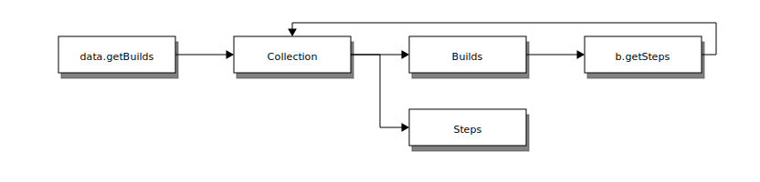

.. _WWW-data-module:

Javascript Data Module
======================

The Data module is a reusable AngularJS module used to access Buildbot's data API from the browser.
Its main purpose is to handle the 3 way binding.

2 way binding is the angular MVVM concept, which seamlessly synchronise the view and the model.
Here, we introduce an additional way of synchronisation, which is from the server to the model.

We use the message queue and the websocket interfaces to maintain synchronisation between the server and the client.

The client application just needs to query the needed data using a highlevel API, and the data module uses the best approach to make the data always up to date.

Once the binding is set up by the controller, everything is automatically up to date.

Base Concepts
-------------

Collections
~~~~~~~~~~~
All the data you can get are Collections.
Even a query to a single resource returns a collection.
A collection is an Array subclass which has extra capabilities:

- It listens to the event stream and is able to maintain itself up-to-date
- It implements client side queries in order to guarantee up-to-date filtering, ordering and limiting queries.
- It has a fast access to each item it contains via its id.
- It has its own event handlers so that the client code can react when the Collection is changing

Wrappers
~~~~~~~~
Each data type contained in a collection is wrapped in a javascript object.
This allows to create some custom enhancements to the data model.
For example, the Change wrapper decodes the author name and email from the "author" field.

Each wrapper class also has specific access methods, which allow to access more data from the REST hierarchy.

Installation
~~~~~~~~~~~~

The Data module is available as a standalone AngularJS module.

Installation via yarn:

  .. code-block:: sh

      yarn add buildbot-data

Inject the ``bbData`` module to your application:

  .. code-block:: javascript

      angular.module('myApp', ['bbData'])

Service API
~~~~~~~~~~~

.. js:class:: DataService

  DataService is the service used for accessing the Buildbot data API.
  It has a modern interface for accessing data in such a way that the updating of the data via web socket is transparent.

  .. js:method:: open()

    :returns: a DataAccessor which handles 3 way data binding

    Open a new accessor every time you need to update the data in a controller.

    It registers on $destroy event on the scope, and thus automatically unsubscribes from updates when the data is not used anymore.

    .. code-block:: javascript

      // open a new accessor every time you need updating data in a controller
      class DemoController {
          constructor($scope, dataService) {
              // automatically closes all the bindings when the $scope is destroyed
              const data = dataService.open().closeOnDestroy($scope);

              // request new data, it updates automatically
              this.builders = data.getBuilders({limit: 10, order: '-started_at'});
          }
      }

  .. js:method:: getXs([id], [query])

    ``Xs`` can be the following: ``Builds``, ``Builders``, ``Buildrequests``, ``Buildsets``, ``Workers``, ``Changes``, ``Changesources``, ``Forceschedulers``, ``Masters``, ``Schedulers``, ``Sourcestamps``.

    It's highly advised to use these methods instead of the lower level ``get('string')``.

    :returns: collection which will eventually contain all the requested data

    The collections returned without using an accessor are not automatically updated.
    So use those methods only when you know the data are not changing.

    .. code-block:: javascript

      // assign builds to $scope.builds and then load the steps when the builds are discovered
      // onNew is called at initial load
      $scope.builds = dataService.getBuilds({builderid: 1});
      $scope.builds.onNew = build => build.loadSteps();

  .. js:method:: get(endpoint, [id], [query])

    :returns: a collection; when the promise is resolved, the collection contains all the requested data

    .. code-block:: javascript

      // assign builds to $scope.builds once the Collection is filled
      const builderid = 1;
      $scope.builds = dataService.get(`builders/${builderid}/builds`, {limit: 1});
      $scope.builds.onNew = build => build.loadSteps();

    .. code-block:: javascript

      // assign builds to $scope.builds before the Collection is filled using the
      // getArray() method
      $scope.builds = dataService.get('builds', {builderid: 1});

  .. js:method:: control(url, method, [params])

    :returns: a promise; sends a JSON RPC2 POST request to the server

    .. code-block:: javascript

      // open a new accessor every time you need to update the data in a controller
      dataService.control('forceschedulers/force', 'force')
          .then(response => $log.debug(response),
                reason => $log.error(reason));

.. js:class:: DataAccessor

  DataAccessor object is returned by the ``dataService.open()`` method.

  .. js:method:: closeOnDestroy($scope)

    Registers scope destruction as waterfall destruction for all collection accessed via this accessor.

  .. js:method:: close()

    Destructs all collections previously accessed via this accessor.
    Destroying a collection means it will unsubscribe from any events necessary to maintain it up-to-date.

  .. js:method:: getXs([id], [query])

    Same methods as in DataService, except here the data will be maintained up-to-date.

    :returns: a collection which will eventually contain all the requested data

.. js:class:: Collections

  .. js:method:: get(id)

    This method does not do any network access, and thus only knows about data already fetched.

    :returns: one element of the collection by id, or undefined, if this id is unknown to the collection.

  .. js:method:: hasOwnProperty(id)

    :returns: true if this id is known by this collection.

  .. js:method:: close()

    Forcefully unsubscribes this connection from auto-update.
    Normally, this is done automatically on scope destruction, but sometimes, when you got enough data, you want to save bandwidth and disconnect the collection.

  .. js:method:: put(object)

    Inserts one plain object to the collection.
    As an external API, this method is only useful for unit tests to simulate new data coming asynchronously.

  .. js:method:: from(object_list)

    Inserts several plain objects to the collection.
    This method is only useful for unit tests to simulate new data coming asynchronously.

  .. js:method:: onNew = (object) ->

    Callback method which is called when a new object arrives in the collection.
    This can be called either when initial data is coming via REST API, or when data is coming via the event stream.
    The affected object is given in parameter.
    `this` context is the collection.

  .. js:method:: onUpdate = (object) ->

    Callback method which is called when an object is modified.
    This is called when data is coming via the event stream.
    The affected object is given in parameter.
    `this` context is the collection.

  .. js:method:: onChange = (collection) ->

    Callback method which is called when an object is modified.
    This is called when data is coming via the event stream.
    `this` context is the collection.
    The full collection is given in parameter (in case you override ``this`` via fat arrow).

  .. js:attribute:: $ready

    Attribute similar to what ``ngResource`` provides.
    True after first server interaction is completed, false before that.
    Knowing if the Collection has been resolved is useful in data-binding (for example to display a loading graphic).

.. js:class:: Wrapper

  Wrapper objects are objects stored in the collection.
  These objects have specific methods, depending on their types.

  .. js:method:: getXs([id], [query])

    Same as ``DataService.getXs``, but with a relative endpoint.

    :returns: a collection; when the promise is resolved, the collection contains all the requested data

    .. code-block:: javascript

      // assign builds to $scope.builds once the Collection is filled
      $scope.builds = dataService.getBuilds({builderid: 1});
      $scope.builds.onNew = function(b) {
          b.complete_steps = b.getSteps({complete:true});
          b.running_steps = b.getSteps({complete:false});
      };

  .. js:method:: loadXs([id], [query])

    ``o.loadXs()`` is equivalent to ``o.xs = o.getXs()``.

    :returns: a collection; the collection contains all the requested data, which is also assigned to ``o.Xs``

    .. code-block:: javascript

      // get builder with id = 1
      dataService.getBuilders(1).onNew = builder => {
          // load all builds in builder.builds
          builder.loadBuilds().onNew(build => {
              // load all buildsteps in build.steps
              build.loadSteps();
          });
      };

  .. js:method:: control(method, params)

    :returns: a promise; sends a JSON RPC2 POST request to the server
