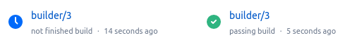

.. bb:reporter:: BitbucketStatusPush

BitbucketStatusPush
+++++++++++++++++++

.. py:currentmodule:: buildbot.reporters.bitbucket

.. code-block:: python

    from buildbot.plugins import reporters

    c['services'].append(reporters.BitbucketStatusPush('oauth_key', 'oauth_secret'))

:class:`BitbucketStatusPush` publishes build status using the `Bitbucket Build Status API <https://confluence.atlassian.com/bitbucket/buildstatus-resource-779295267.html>`_.
The build status is published to a specific commit SHA in Bitbucket.
By default, it tracks the last build for each builder and each commit built.

It requires `txrequests`_ package to allow interaction with the Bitbucket REST and OAuth APIs.

It uses OAuth 2.x to authenticate with Bitbucket.
To enable this, you need to go to your Bitbucket Settings -> OAuth page.
Click "Add consumer".
Give the new consumer a name, e.g. buildbot, and put in any URL as the callback (this is needed for Oauth 2.x, but it's not used by this reporter), e.g. http://localhost:8010/callback.
Give the consumer `Repositories:Write` access.
After creating the consumer, you will then be able to see the OAuth key and secret.

.. py:class:: BitbucketStatusPush(oauth_key=None, oauth_secret=None, auth=None, base_url='https://api.bitbucket.org/2.0/repositories', oauth_url='https://bitbucket.org/site/oauth2/access_token', status_key=None, status_name=None, generators=None)

    :param string oauth_key: The OAuth consumer key, when using OAuth to authenticate (can be a :ref:`Secret`)
    :param string oauth_secret: The OAuth consumer secret, when using OAuth to authenticate (can be a :ref:`Secret`)
    :param string auth: The ``username,password`` tuple if using App passwords to authenticate (can be a :ref:`Secret`)
    :param string base_url: Bitbucket's Build Status API URL
    :param string oauth_url: Bitbucket's OAuth API URL
    :param string status_key: Key that identifies a build status.
        Setting the key to a unique value per build allows to push multiple build statuses to a given commit.
        A static string can be passed or :class:`Interpolate` for dynamic substitution.
        The default key is ``%(prop:buildername)s``
    :param string status_name: Name of a build status.
        It shows up next to the status icon in Bitbucket.
        A static string can be passed or :class:`Interpolate` for dynamic substitution.
        The default name is ``%(prop:buildername)s``
    :param generators: A list of report generators that will be used to generate reports to be sent by this reporter.
        Currently the reporter will consider only the report generated by the first generator.
        The subject of the report will be used to set the description of the build status.
        The default subject is an empty string
    :param boolean verify: Disable ssl verification for the case you use temporary self signed certificates
    :param boolean debug: Logs every requests and their response

For example, the following reporter

.. code-block:: python

    from buildbot.plugins import reporters

    reporters.BitbucketStatusPush(
        'oauth_key', 'oauth_secret',
        status_key=Interpolate("%(prop:buildername)s/%(prop:buildnumber)s"),
        status_name=Interpolate("%(prop:buildername)s/%(prop:buildnumber)s"),
        generators=[
            reporters.BuildStartEndStatusGenerator(
                start_formatter=reporters.MessageFormatter(subject="{{ status_detected }}"),
                end_formatter=reporters.MessageFormatter(subject="{{ status_detected }}"))
        ])
    c['services'].append(ss)

produces the build statuses below when a build stars and ends, respectively.

.. _txrequests: https://pypi.python.org/pypi/txrequests
