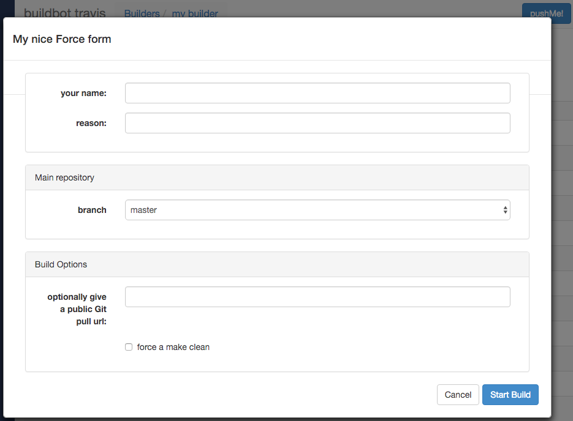

.. -*- rst -*-
.. _Schedulers:

Schedulers
----------

.. contents::
    :depth: 2
    :local:

Schedulers are responsible for initiating builds on builders.

Some schedulers listen for changes from ChangeSources and generate build sets in response to these changes.
Others generate build sets without changes, based on other events in the buildmaster.

.. _Configuring-Schedulers:

Configuring Schedulers
~~~~~~~~~~~~~~~~~~~~~~

.. bb:cfg:: schedulers

The :bb:cfg:`schedulers` configuration parameter gives a list of scheduler instances, each of which causes builds to be started on a particular set of Builders.
The two basic scheduler classes you are likely to start with are :bb:sched:`SingleBranchScheduler` and :bb:sched:`Periodic`, but you can write a customized subclass to implement more complicated build scheduling.

Scheduler arguments should always be specified by name (as keyword arguments), to allow for future expansion:

.. code-block:: python

    sched = SingleBranchScheduler(name="quick", builderNames=['lin', 'win'])

There are several common arguments for schedulers, although not all are available with all schedulers.

.. _Scheduler-Attr-Name:

``name``

    Each Scheduler must have a unique name.
    This is used in status displays, and is also available in the build property ``scheduler``.

.. _Scheduler-Attr-BuilderNames:

``builderNames``

    This is the set of builders which this scheduler should trigger, specified as a list of names (strings).
    This can also be an :class:`~IRenderable` object which will render to a list of builder names (or a list of :class:`~IRenderable` that will render to builder names).

    .. note:: When ``builderNames`` is rendered, these additional :class:`~Properties` attributes are available:

       ``master``

           A reference to the :class:`~BuildMaster` object that owns this scheduler.
           This can be used to access the data API.

       ``sourcestamps``

           The list of sourcestamps that triggered the scheduler.

       ``changes``

           The list of changes associated with the sourcestamps.

       ``files``

           The list of modified files associated with the changes.

       Any property attached to the change(s) that triggered the scheduler will be combined and available when rendering `builderNames`.

    Here is a simple example:

    .. code-block:: python

       from buildbot.plugins import util, schedulers

       @util.renderer
       def builderNames(props):
           builders = set()
           for f in props.files:
               if f.endswith('.rst'):
                   builders.add('check_docs')
               if f.endswith('.c'):
                   builders.add('check_code')
           return list(builders)

       c['schedulers'] = [
           schedulers.AnyBranchScheduler(
               name='all',
               builderNames=builderNames,
           )
       ]

    And a more complex one:

    .. code-block:: python

       import fnmatch

       from twisted.internet import defer

       from buildbot.plugins import util, schedulers

       @util.renderer
       @defer.inlineCallbacks
       def builderNames(props):
           # If "buildername_pattern" is defined with "buildbot sendchange",
           # check if the builder name matches it.
           pattern = props.getProperty('buildername_pattern')

           # If "builder_tags" is defined with "buildbot sendchange",
           # only schedule builders that have the specified tags.
           tags = props.getProperty('builder_tags')

           builders = []

           for b in (yield props.master.data.get(('builders',))):
               if pattern and not fnmatch.fnmatchcase(b['name'], pattern):
                   continue
               if tags and not set(tags.split()).issubset(set(b['tags'])):
                   continue
               builders.append(b['name'])

           return builders

       c['schedulers'] = [
          schedulers.AnyBranchScheduler(
             name='matrix',
             builderNames=builderNames,
          )
       ]

.. index:: Properties; from scheduler

.. _Scheduler-Attr-Properties:

``properties`` (optional)

    This is a dictionary specifying properties that will be transmitted to all builds started by this scheduler.
    The ``owner`` property may be of particular interest, as its contents (list) will be added to the list of "interested users" (:ref:`Doing-Things-With-Users`) for each triggered build.
    For example:

    .. code-block:: python

        sched = Scheduler(...,
            properties = {
                'owner': ['zorro@example.com', 'silver@example.com']
            })

.. _Scheduler-Attr-Codebases:

``codebases`` (optional)

    Specifies codebase definitions that are used when the scheduler processes data from more than one repository at the same time.

    The ``codebases`` parameter is only used to fill in missing details about a codebase when scheduling a build.
    For example, when a change to codebase ``A`` occurs, a scheduler must invent a sourcestamp for codebase ``B``.
    Source steps that specify codebase ``B`` as their codebase will use the invented timestamp.

    The parameter does not act as a filter on incoming changes -- use a change filter for that purpose.

    This parameter can be specified in two forms:

        - as a list of strings.
          This is the simplest form; use it if no special overrides are needed.
          In this form, just the names of the codebases are listed.

        - as a dictionary of dictionaries.
          In this form, the per-codebase overrides of repository, branch and revision can be specified.

    Each codebase definition dictionary is a dictionary with any of the keys: ``repository``, ``branch``, ``revision``.
    The codebase definitions are combined in a dictionary keyed by the name of the codebase.

    .. code-block:: python

        codebases = {'codebase1': {'repository':'....',
                                   'branch':'default',
                                   'revision': None},
                     'codebase2': {'repository':'....'} }

.. _Scheduler-Attr-FileIsImportant:

``fileIsImportant`` (optional)

    A callable which takes as argument a Change instance and returns ``True`` if the change is worth building, and ``False`` if it is not.
    Unimportant Changes are accumulated until the build is triggered by an important change.
    The default value of ``None`` means that all Changes are important.

.. _Scheduler-Attr-ChangeFilter:

``change_filter`` (optional)

    The change filter that will determine which changes are recognized by this scheduler (see :ref:`ChangeFilter`).
    Note that this is different from ``fileIsImportant``; if the change filter filters out a change, the change is completely ignored by the scheduler.
    If a change is allowed by the change filter but is deemed unimportant, it will not cause builds to start but will be remembered and shown in status displays.
    The default value of ``None`` does not filter any changes at all.

.. _Scheduler-Attr-OnlyImportant:

``onlyImportant`` (optional)

    A boolean that, when ``True``, only adds important changes to the buildset as specified in the ``fileIsImportant`` callable.
    This means that unimportant changes are ignored the same way a ``change_filter`` filters changes.
    The default value is ``False`` and only applies when ``fileIsImportant`` is given.

.. _Scheduler-Attr-Reason:

``reason`` (optional)

    A string that will be used as the reason for the triggered build.
    By default it lists the type and name of the scheduler triggering the build.

The remaining subsections represent a catalog of the available scheduler types.
All these schedulers are defined in modules under :mod:`buildbot.schedulers`, and their docstrings are the best source of documentation on the arguments each one takes.

Scheduler Resiliency
~~~~~~~~~~~~~~~~~~~~

In a multi-master configuration, schedulers with the same name can be configured on multiple masters.
Only one instance of the scheduler will be active.
If that instance becomes inactive, due to its master being shut down or failing, then another instance will become active after a short delay.
This provides resiliency in scheduler configurations, so that schedulers are not a single point of failure in a Buildbot infrastructure.

The Data API and web UI display the master on which each scheduler is running.

There is currently no mechanism to control which master's scheduler instance becomes active.
The behavior is nondeterministic, based on the timing of polling by inactive schedulers.
The failover is non-revertive.

Usage example
~~~~~~~~~~~~~

A *quick* scheduler might exist to give immediate feedback to developers, hoping to catch obvious problems in the code that can be detected quickly.
These typically do not run the full test suite, nor do they run on a wide variety of platforms.
They also usually do a VC update rather than performing a brand-new checkout each time.

A separate *full* scheduler might run more comprehensive tests, to catch more subtle problems.
It might be configured to run after the quick scheduler, to give developers time to commit fixes to bugs caught by the quick scheduler before running the comprehensive tests.
This scheduler would also feed multiple :class:`Builder`\s.

Many schedulers can be configured to wait a while after seeing a source-code change - this is the *tree stable timer*.
The timer allows multiple commits to be "batched" together.
This is particularly useful in distributed version control systems, where a developer may push a long sequence of changes all at once.
To save resources, it's often desirable only to test the most recent change.

Schedulers can also filter out the changes they are interested in, based on a number of criteria.
For example, a scheduler that only builds documentation might skip any changes that do not affect the documentation.
Schedulers can also filter on the branch to which a commit was made.

Periodic builds (those which are run every N seconds rather than after new Changes arrive) are triggered by a special :bb:sched:`Periodic` scheduler.

Each scheduler creates and submits :class:`BuildSet` objects to the :class:`BuildMaster`, which is then responsible for making sure the individual :class:`BuildRequests` are delivered to the target :class:`Builder`\s.

Scheduler instances are activated by placing them in the :bb:cfg:`schedulers` list in the buildmaster config file.
Each scheduler must have a unique name.

Scheduler Types
~~~~~~~~~~~~~~~

.. bb:sched:: SingleBranchScheduler
.. bb:sched:: Scheduler

.. _Scheduler-SingleBranchScheduler:

SingleBranchScheduler
:::::::::::::::::::::

This is the original and still most popular scheduler class.
It follows exactly one branch, and starts a configurable tree-stable-timer after each change on that branch.
When the timer expires, it starts a build on some set of Builders.
This scheduler accepts a :meth:`fileIsImportant` function which can be used to ignore some Changes if they do not affect any *important* files.

If ``treeStableTimer`` is not set, then this scheduler starts a build for every Change that matches its ``change_filter`` and satisfies :meth:`fileIsImportant`.
If ``treeStableTimer`` is set, then a build is triggered for each set of Changes that arrive in intervals shorter than the configured time and match the filters.

.. note::

   The behavior of this scheduler is undefined, if ``treeStableTimer`` is set, and changes from multiple branches, repositories or codebases are accepted by the filter.

.. note::

   The ``codebases`` argument will filter out codebases not specified there, but *won't* filter based on the branches specified there.

The arguments to this scheduler are:

``name``

    See :ref:`name scheduler argument <Scheduler-Attr-Name>`.

``builderNames``

    See :ref:`builderNames scheduler argument <Scheduler-Attr-BuilderNames>`.

``properties`` (optional)

    See :ref:`properties scheduler argument <Scheduler-Attr-Properties>`.

``codebases`` (optional)

    See :ref:`codebases scheduler argument <Scheduler-Attr-Codebases>`.

``fileIsImportant`` (optional)

    See :ref:`fileIsImportant scheduler argument <Scheduler-Attr-FileIsImportant>`.

``change_filter`` (optional)

    See :ref:`change_filter scheduler argument <Scheduler-Attr-ChangeFilter>`.

``onlyImportant`` (optional)

    See :ref:`onlyImportant scheduler argument <Scheduler-Attr-OnlyImportant>`.

``reason`` (optional)

    See :ref:`reason scheduler argument <Scheduler-Attr-Reason>`.

``treeStableTimer``

    The scheduler will wait for this many seconds before starting the build.
    If new changes are made during this interval, the timer will be restarted.
    So the build will be started after this many seconds of inactivity following the last change.

    If ``treeStableTimer`` is ``None``, then a separate build is started immediately for each Change.

``categories`` (deprecated; use change_filter)

    A list of categories of changes that this scheduler will respond to.
    If this is specified, then any non-matching changes are ignored.

``branch`` (deprecated; use change_filter)

    The scheduler will pay attention to this branch, ignoring Changes that occur on other branches.
    Setting ``branch`` equal to the special value of ``None`` means it should only pay attention to the default branch.

    .. note::

       ``None`` is a keyword, not a string, so write ``None`` and not ``"None"``.

Example:

.. code-block:: python

    from buildbot.plugins import schedulers, util
    quick = schedulers.SingleBranchScheduler(
                name="quick",
                change_filter=util.ChangeFilter(branch='master'),
                treeStableTimer=60,
                builderNames=["quick-linux", "quick-netbsd"])
    full = schedulers.SingleBranchScheduler(
                name="full",
                change_filter=util.ChangeFilter(branch='master'),
                treeStableTimer=5*60,
                builderNames=["full-linux", "full-netbsd", "full-OSX"])
    c['schedulers'] = [quick, full]

In this example, the two *quick* builders are triggered 60 seconds after the tree has been changed.
The *full* builders do not run quite that quickly (they wait 5 minutes), so that hopefully, if the quick builds fail due to a missing file or a simple typo, the developer can discover and fix the problem before the full builds are started.
Both schedulers only pay attention to the default branch: any changes on other branches are ignored.
Each scheduler triggers a different set of builders, referenced by name.

.. note::

   The old names for this scheduler, ``buildbot.scheduler.Scheduler`` and ``buildbot.schedulers.basic.Scheduler``, are deprecated in favor of using :mod:`buildbot.plugins`:

   .. code-block:: python

        from buildbot.plugins import schedulers

   However if you must use a fully qualified name, it is ``buildbot.schedulers.basic.SingleBranchScheduler``.

.. bb:sched:: AnyBranchScheduler

.. _AnyBranchScheduler:

AnyBranchScheduler
::::::::::::::::::

This scheduler uses a tree-stable-timer like the default one, but uses a separate timer for each branch.

If ``treeStableTimer`` is not set, then this scheduler is indistinguishable from :bb:sched:`SingleBranchScheduler`.
If ``treeStableTimer`` is set, then a build is triggered for each set of Changes that arrive in intervals shorter than the configured time and match the filters.

The arguments to this scheduler are:

``name``

    See :ref:`name scheduler argument <Scheduler-Attr-Name>`.

``builderNames``

    See :ref:`builderNames scheduler argument <Scheduler-Attr-BuilderNames>`.

``properties`` (optional)

    See :ref:`properties scheduler argument <Scheduler-Attr-Properties>`.

``codebases`` (optional)

    See :ref:`codebases scheduler argument <Scheduler-Attr-Codebases>`.

``fileIsImportant`` (optional)

    See :ref:`fileIsImportant scheduler argument <Scheduler-Attr-FileIsImportant>`.

``change_filter`` (optional)

    See :ref:`change_filter scheduler argument <Scheduler-Attr-ChangeFilter>`.

``onlyImportant`` (optional)

    See :ref:`onlyImportant scheduler argument <Scheduler-Attr-OnlyImportant>`.

``reason`` (optional)

    See :ref:`reason scheduler argument <Scheduler-Attr-Reason>`.

``treeStableTimer``

    The scheduler will wait for this many seconds before starting a build.
    If new changes are made *on the same branch* during this interval, the timer will be restarted.

``branches`` (deprecated; use change_filter)

    Changes on branches not specified on this list will be ignored.

``categories`` (deprecated; use change_filter)

    A list of categories of changes that this scheduler will respond to.
    If this is specified, then any non-matching changes are ignored.

.. bb:sched:: Dependent

.. _Dependent-Scheduler:

Dependent Scheduler
:::::::::::::::::::

It is common to wind up with one kind of build which should only be performed if the same source code was successfully handled by some other kind of build first.
An example might be a packaging step: you might only want to produce .deb or RPM packages from a tree that was known to compile successfully and pass all unit tests.
You could put the packaging step in the same Build as the compile and testing steps, but there might be other reasons to not do this (in particular you might have several Builders worth of compiles/tests, but only wish to do the packaging once).
Another example is if you want to skip the *full* builds after a failing *quick* build of the same source code.
Or, if one Build creates a product (like a compiled library) that is used by some other Builder, you'd want to make sure the consuming Build is run *after* the producing one.

You can use *dependencies* to express this relationship to Buildbot.
There is a special kind of scheduler named :bb:sched:`Dependent` that will watch an *upstream* scheduler for builds to complete successfully (on all of its Builders).
Each time that happens, the same source code (i.e. the same ``SourceStamp``) will be used to start a new set of builds, on a different set of Builders.
This *downstream* scheduler doesn't pay attention to Changes at all.
It only pays attention to the upstream scheduler.

If the build fails on any of the Builders in the upstream set, the downstream builds will not fire.
Note that, for SourceStamps generated by a :bb:sched:`Dependent` scheduler, the ``revision`` is ``None``, meaning HEAD.
If any changes are committed between the time the upstream scheduler begins its build and the time the dependent scheduler begins its build, then those changes will be included in the downstream build.
See the :bb:sched:`Triggerable` scheduler for a more flexible dependency mechanism that can avoid this problem.

The arguments to this scheduler are:

``name``

    See :ref:`name scheduler argument <Scheduler-Attr-Name>`.

``builderNames``

    See :ref:`builderNames scheduler argument <Scheduler-Attr-BuilderNames>`.

``properties`` (optional)

    See :ref:`properties scheduler argument <Scheduler-Attr-Properties>`.

``codebases`` (optional)

    See :ref:`codebases scheduler argument <Scheduler-Attr-Codebases>`.

``upstream``

    The upstream scheduler to watch.
    Note that this is an *instance*, not the name of the scheduler.

Example:

.. code-block:: python

    from buildbot.plugins import schedulers
    tests = schedulers.SingleBranchScheduler(name="just-tests",
                                             treeStableTimer=5*60,
                                             builderNames=["full-linux",
                                                           "full-netbsd",
                                                           "full-OSX"])
    package = schedulers.Dependent(name="build-package",
                                   upstream=tests, # <- no quotes!
                                   builderNames=["make-tarball", "make-deb",
                                                 "make-rpm"])
    c['schedulers'] = [tests, package]

.. bb:sched:: Periodic

.. _Periodic-Scheduler:

Periodic Scheduler
::::::::::::::::::

This simple scheduler just triggers a build every *N* seconds.

The arguments to this scheduler are:

``name``

    See :ref:`name scheduler argument <Scheduler-Attr-Name>`.

``builderNames``

    See :ref:`builderNames scheduler argument <Scheduler-Attr-BuilderNames>`.

``properties`` (optional)

    See :ref:`properties scheduler argument <Scheduler-Attr-Properties>`.

``codebases`` (optional)

    See :ref:`codebases scheduler argument <Scheduler-Attr-Codebases>`.

``fileIsImportant`` (optional)

    See :ref:`fileIsImportant scheduler argument <Scheduler-Attr-FileIsImportant>`.

``change_filter`` (optional)

    See :ref:`change_filter scheduler argument <Scheduler-Attr-ChangeFilter>`.

``onlyImportant`` (optional)

    See :ref:`onlyImportant scheduler argument <Scheduler-Attr-OnlyImportant>`.

``reason`` (optional)

    See :ref:`reason scheduler argument <Scheduler-Attr-Reason>`.

``createAbsoluteSourceStamps`` (optional)

    This option only has effect when using multiple codebases.
    When ``True``, it uses the last seen revision for each codebase that does not have a change.
    When ``False`` (the default), codebases without changes will use the revision from the ``codebases`` argument.

``onlyIfChanged`` (optional)

    If this is ``True``, then builds will be scheduled at the designated time only if the specified branch has seen an important change since the previous build.
    If there is no previous build or the previous build was made when this option was ``False`` then the build will be scheduled even if there are no new changes.
    By default this setting is ``False``.

``periodicBuildTimer``

    The time, in seconds, after which to start a build.

Example:

.. code-block:: python

    from buildbot.plugins import schedulers
    nightly = schedulers.Periodic(name="daily",
                                  builderNames=["full-solaris"],
                                  periodicBuildTimer=24*60*60)
    c['schedulers'] = [nightly]

The scheduler in this example just runs the full solaris build once per day.
Note that this scheduler only lets you control the time between builds, not the absolute time-of-day of each Build, so this could easily wind up an *evening* or *every afternoon* scheduler depending upon when it was first activated.

.. bb:sched:: Nightly

.. _Nightly-Scheduler:

Nightly Scheduler
:::::::::::::::::

This is highly configurable periodic build scheduler, which triggers a build at particular times of day, week, month, or year.
The configuration syntax is very similar to the well-known ``crontab`` format, in which you provide values for minute, hour, day, and month (some of which can be wildcards), and a build is triggered whenever the current time matches the given constraints.
This can run a build every night, every morning, every weekend, alternate Thursdays, on your boss's birthday, etc.

Pass some subset of ``minute``, ``hour``, ``dayOfMonth``, ``month``, and ``dayOfWeek``\; each may be a single number or a list of valid values.
The builds will be triggered whenever the current time matches these values.
Wildcards are represented by a '*' string.
All fields default to a wildcard except 'minute', so with no fields, this defaults to a build every hour, on the hour.
The full list of parameters is:

``name``

    See :ref:`name scheduler argument <Scheduler-Attr-Name>`.

``builderNames``

    See :ref:`builderNames scheduler argument <Scheduler-Attr-BuilderNames>`.

``properties`` (optional)

    See :ref:`properties scheduler argument <Scheduler-Attr-Properties>`.

``codebases`` (optional)

    See :ref:`codebases scheduler argument <Scheduler-Attr-Codebases>`.

``fileIsImportant`` (optional)

    See :ref:`fileIsImportant scheduler argument <Scheduler-Attr-FileIsImportant>`.

``change_filter`` (optional)

    See :ref:`change_filter scheduler argument <Scheduler-Attr-ChangeFilter>`.

``onlyImportant`` (optional)

    See :ref:`onlyImportant scheduler argument <Scheduler-Attr-OnlyImportant>`.

``reason`` (optional)

    See :ref:`reason scheduler argument <Scheduler-Attr-Reason>`.

``createAbsoluteSourceStamps`` (optional)

    This option only has effect when using multiple codebases.
    When ``True``, it uses the last seen revision for each codebase that does not have a change.
    When ``False`` (the default), codebases without changes will use the revision from the ``codebases`` argument.

``onlyIfChanged`` (optional)

    If this is ``True``, then builds will not be scheduled at the designated time *unless* the change filter has accepted an important change since the previous build.
    The default value is ``False``.

``branch`` (optional)

    (Deprecated; use ``change_filter`` and ``codebases``.)
    The branch to build when the time comes, and the branch to filter for if ``change_filter`` is not specified.
    Remember that a value of ``None`` here means the default branch, and will not match other branches!

``minute`` (optional)

    The minute of the hour on which to start the build.
    This defaults to 0, meaning an hourly build.

``hour`` (optional)

    The hour of the day on which to start the build, in 24-hour notation.
    This defaults to \*, meaning every hour.

``dayOfMonth`` (optional)

    The day of the month to start a build.
    This defaults to ``*``, meaning every day.

``month`` (optional)

    The month in which to start the build, with January = 1.
    This defaults to ``*``, meaning every month.

``dayOfWeek`` (optional)

    The day of the week to start a build, with Monday = 0.
    This defaults to ``*``, meaning every day of the week.

For example, the following :file:`master.cfg` clause will cause a build to be started every night at 3:00am:

.. code-block:: python

    from buildbot.plugins import schedulers, util
    c['schedulers'].append(
        schedulers.Nightly(name='nightly',
                           change_filter=util.ChangeFilter(branch='master'),
                           builderNames=['builder1', 'builder2'],
                           hour=3, minute=0))

This scheduler will perform a build each Monday morning at 6:23am and again at 8:23am, but only if someone has committed code in the interim:

.. code-block:: python

    c['schedulers'].append(
        schedulers.Nightly(name='BeforeWork',
                           change_filter=util.ChangeFilter(branch='default'),
                           builderNames=['builder1'],
                           dayOfWeek=0, hour=[6,8], minute=23,
                           onlyIfChanged=True))

The following runs a build every two hours, using Python's :func:`range` function:

.. code-block:: python

    c.schedulers.append(
        schedulers.Nightly(name='every2hours',
                           change_filter=util.ChangeFilter(branch=None),  # default branch
                           builderNames=['builder1'],
                           hour=range(0, 24, 2)))

Finally, this example will run only on December 24th:

.. code-block:: python

    c['schedulers'].append(
        schedulers.Nightly(name='SleighPreflightCheck',
                           change_filter=util.ChangeFilter(branch=None),  # default branch
                           builderNames=['flying_circuits', 'radar'],
                           month=12,
                           dayOfMonth=24,
                           hour=12,
                           minute=0))

.. bb:sched:: Try_Jobdir
.. bb:sched:: Try_Userpass

.. _Try-Schedulers:

Try Schedulers
::::::::::::::

This scheduler allows developers to use the :bb:cmdline:`buildbot try<try>` command to trigger builds of code they have not yet committed.
See :bb:cmdline:`try` for complete details.

Two implementations are available: :bb:sched:`Try_Jobdir` and :bb:sched:`Try_Userpass`.
The former monitors a job directory, specified by the ``jobdir`` parameter, while the latter listens for PB connections on a specific ``port``, and authenticates against ``userport``.

The buildmaster must have a scheduler instance in the config file's :bb:cfg:`schedulers` list to receive try requests.
This lets the administrator control who may initiate these `trial` builds, which branches are eligible for trial builds, and which Builders should be used for them.

The scheduler has various means to accept build requests.
All of them enforce more security than the usual buildmaster ports do.
Any source code being built can be used to compromise the worker accounts, but in general that code must be checked out from the VC repository first, so only people with commit privileges can get control of the workers.
The usual force-build control channels can waste worker time but do not allow arbitrary commands to be executed by people who don't have those commit privileges.
However, the source code patch that is provided with the trial build does not have to go through the VC system first, so it is important to make sure these builds cannot be abused by a non-committer to acquire as much control over the workers as a committer has.
Ideally, only developers who have commit access to the VC repository would be able to start trial builds, but unfortunately, the buildmaster does not, in general, have access to the VC system's user list.

As a result, the try scheduler requires a bit more configuration.
There are currently two ways to set this up:

``jobdir`` (ssh)

    This approach creates a command queue directory, called the :file:`jobdir`, in the buildmaster's working directory.
    The buildmaster admin sets the ownership and permissions of this directory to only grant write access to the desired set of developers, all of whom must have accounts on the machine.
    The :command:`buildbot try` command creates a special file containing the source stamp information and drops it in the jobdir, just like a standard maildir.
    When the buildmaster notices the new file, it unpacks the information inside and starts the builds.

    The config file entries used by 'buildbot try' either specify a local queuedir (for which write and mv are used) or a remote one (using scp and ssh).

    The advantage of this scheme is that it is quite secure, the disadvantage is that it requires fiddling outside the buildmaster config (to set the permissions on the jobdir correctly).
    If the buildmaster machine happens to also house the VC repository, then it can be fairly easy to keep the VC userlist in sync with the trial-build userlist.
    If they are on different machines, this will be much more of a hassle.
    It may also involve granting developer accounts on a machine that would not otherwise require them.

    To implement this, the worker invokes :samp:`ssh -l {username} {host} buildbot tryserver {ARGS}`, passing the patch contents over stdin.
    The arguments must include the inlet directory and the revision information.

``user+password`` (PB)

    In this approach, each developer gets a username/password pair, which are all listed in the buildmaster's configuration file.
    When the developer runs :command:`buildbot try`, their machine connects to the buildmaster via PB and authenticates themselves using that username and password, then sends a PB command to start the trial build.

    The advantage of this scheme is that the entire configuration is performed inside the buildmaster's config file.
    The disadvantages are that it is less secure (while the `cred` authentication system does not expose the password in plaintext over the wire, it does not offer most of the other security properties that SSH does).
    In addition, the buildmaster admin is responsible for maintaining the username/password list, adding and deleting entries as developers come and go.

For example, to set up the `jobdir` style of trial build, using a command queue directory of :file:`{MASTERDIR}/jobdir` (and assuming that all your project developers were members of the ``developers`` unix group), you would first set up that directory:

.. code-block:: bash

    mkdir -p MASTERDIR/jobdir MASTERDIR/jobdir/new MASTERDIR/jobdir/cur MASTERDIR/jobdir/tmp
    chgrp developers MASTERDIR/jobdir MASTERDIR/jobdir/*
    chmod g+rwx,o-rwx MASTERDIR/jobdir MASTERDIR/jobdir/*

and then use the following scheduler in the buildmaster's config file:

.. code-block:: python

    from buildbot.plugins import schedulers
    s = schedulers.Try_Jobdir(name="try1",
                              builderNames=["full-linux", "full-netbsd", "full-OSX"],
                              jobdir="jobdir")
    c['schedulers'] = [s]

Note that you must create the jobdir before telling the buildmaster to use this configuration, otherwise you will get an error.
Also remember that the buildmaster must be able to read and write to the jobdir as well.
Be sure to watch the :file:`twistd.log` file (:ref:`Logfiles`) as you start using the jobdir, to make sure the buildmaster is happy with it.

.. note::

   Patches in the jobdir are encoded using netstrings, which place an arbitrary upper limit on patch size of 99999 bytes.
   If your submitted try jobs are rejected with `BadJobfile`, try increasing this limit with a snippet like this in your `master.cfg`:

   .. code-block:: python

        from twisted.protocols.basic import NetstringReceiver
        NetstringReceiver.MAX_LENGTH = 1000000

To use the username/password form of authentication, create a :class:`Try_Userpass` instance instead.
It takes the same ``builderNames`` argument as the :class:`Try_Jobdir` form, but accepts an additional ``port`` argument (to specify the TCP port to listen on) and a ``userpass`` list of username/password pairs to accept.
Remember to use good passwords for this: the security of the worker accounts depends upon it:

.. code-block:: python

    from buildbot.plugins import schedulers
    s = schedulers.Try_Userpass(name="try2",
                                builderNames=["full-linux", "full-netbsd", "full-OSX"],
                                port=8031,
                                userpass=[("alice","pw1"), ("bob", "pw2")])
    c['schedulers'] = [s]

Like in most classes in Buildbot, the ``port`` argument takes a `strports` specification.
See :mod:`twisted.application.strports` for details.

.. bb:sched:: Triggerable

.. index:: Triggers

.. _Triggerable-Scheduler:

Triggerable Scheduler
:::::::::::::::::::::

The :bb:sched:`Triggerable` scheduler waits to be triggered by a :bb:step:`Trigger` step (see :ref:`Step-Trigger`) in another build.
That step can optionally wait for the scheduler's builds to complete.
This provides two advantages over :bb:sched:`Dependent` schedulers.
First, the same scheduler can be triggered from multiple builds.
Second, the ability to wait for :bb:sched:`Triggerable`'s builds to complete provides a form of "subroutine call", where one or more builds can "call" a scheduler to perform some work for them, perhaps on other workers.
The :bb:sched:`Triggerable` scheduler supports multiple codebases.
The scheduler filters out all codebases from :bb:step:`Trigger` steps that are not configured in the scheduler.

The parameters are just the basics:

``name``

    See :ref:`name scheduler argument <Scheduler-Attr-Name>`.

``builderNames``

    See :ref:`builderNames scheduler argument <Scheduler-Attr-BuilderNames>`.

``properties`` (optional)

    See :ref:`properties scheduler argument <Scheduler-Attr-Properties>`.

``codebases`` (optional)

    See :ref:`codebases scheduler argument <Scheduler-Attr-Codebases>`.

``reason`` (optional)

    See :ref:`reason scheduler argument <Scheduler-Attr-Reason>`.

This class is only useful in conjunction with the :bb:step:`Trigger` step.
Here is a fully-worked example:

.. code-block:: python

    from buildbot.plugins import schedulers, steps, util

    checkin = schedulers.SingleBranchScheduler(name="checkin",
                                               change_filter=util.ChangeFilter(branch=None),
                                               treeStableTimer=5*60,
                                               builderNames=["checkin"])
    nightly = schedulers.Nightly(name='nightly',
                                 change_filter=util.ChangeFilter(branch=None),
                                 builderNames=['nightly'],
                                 hour=3, minute=0)

    mktarball = schedulers.Triggerable(name="mktarball", builderNames=["mktarball"])
    build = schedulers.Triggerable(name="build-all-platforms",
                                   builderNames=["build-all-platforms"])
    test = schedulers.Triggerable(name="distributed-test",
                                  builderNames=["distributed-test"])
    package = schedulers.Triggerable(name="package-all-platforms",
                                     builderNames=["package-all-platforms"])
    c['schedulers'] = [mktarball, checkin, nightly, build, test, package]

    # on checkin, make a tarball, build it, and test it
    checkin_factory = util.BuildFactory()
    checkin_factory.addStep(steps.Trigger(schedulerNames=['mktarball'],
                                          waitForFinish=True))
    checkin_factory.addStep(steps.Trigger(schedulerNames=['build-all-platforms'],
                                          waitForFinish=True))
    checkin_factory.addStep(steps.Trigger(schedulerNames=['distributed-test'],
                                          waitForFinish=True))

    # and every night, make a tarball, build it, and package it
    nightly_factory = util.BuildFactory()
    nightly_factory.addStep(steps.Trigger(schedulerNames=['mktarball'],
                                          waitForFinish=True))
    nightly_factory.addStep(steps.Trigger(schedulerNames=['build-all-platforms'],
                                          waitForFinish=True))
    nightly_factory.addStep(steps.Trigger(schedulerNames=['package-all-platforms'],
                                          waitForFinish=True))

.. bb:sched:: NightlyTriggerable

NightlyTriggerable Scheduler
::::::::::::::::::::::::::::

.. py:class:: buildbot.schedulers.timed.NightlyTriggerable

The :bb:sched:`NightlyTriggerable` scheduler is a mix of the :bb:sched:`Nightly` and :bb:sched:`Triggerable` schedulers.
This scheduler triggers builds at a particular time of day, week, or year, exactly as the :bb:sched:`Nightly` scheduler.
However, the source stamp set that is used is provided by the last :bb:step:`Trigger` step that targeted this scheduler.

The following parameters are just the basics:

``name``

    See :ref:`name scheduler argument <Scheduler-Attr-Name>`.

``builderNames``

    See :ref:`builderNames scheduler argument <Scheduler-Attr-BuilderNames>`.

``properties`` (optional)

    See :ref:`properties scheduler argument <Scheduler-Attr-Properties>`.

``codebases`` (optional)

    See :ref:`codebases scheduler argument <Scheduler-Attr-Codebases>`.

``reason`` (optional)

    See :ref:`reason scheduler argument <Scheduler-Attr-Reason>`.

``minute`` (optional)

    See :bb:sched:`Nightly`.

``hour`` (optional)

    See :bb:sched:`Nightly`.

``dayOfMonth`` (optional)

    See :bb:sched:`Nightly`.

``month`` (optional)

    See :bb:sched:`Nightly`.

``dayOfWeek`` (optional)

    See :bb:sched:`Nightly`.

This class is only useful in conjunction with the :bb:step:`Trigger` step.
Note that ``waitForFinish`` is ignored by :bb:step:`Trigger` steps targeting this scheduler.

Here is a fully-worked example:

.. code-block:: python

    from buildbot.plugins import schedulers, steps, util

    checkin = schedulers.SingleBranchScheduler(name="checkin",
                                               change_filter=util.ChangeFilter(branch=None),
                                               treeStableTimer=5*60,
                                               builderNames=["checkin"])
    nightly = schedulers.NightlyTriggerable(name='nightly',
                                            builderNames=['nightly'],
                                            hour=3, minute=0)
    c['schedulers'] = [checkin, nightly]

    # on checkin, run tests
    checkin_factory = util.BuildFactory([
        steps.Test(),
        steps.Trigger(schedulerNames=['nightly'])
    ])

    # and every night, package the latest successful build
    nightly_factory = util.BuildFactory([
        steps.ShellCommand(command=['make', 'package'])
    ])

.. bb:sched:: ForceScheduler

.. index:: Forced Builds

ForceScheduler Scheduler
::::::::::::::::::::::::

The :bb:sched:`ForceScheduler` scheduler is the way you can configure a force build form in the web UI.

In the ``/#/builders/:builderid`` web page, you will see, on the top right of the page, one button for each :bb:sched:`ForceScheduler` scheduler that was configured for this builder.
If you click on that button, a dialog will let you choose various parameters for requesting a new build.

The Buildbot framework allows you to customize exactly how the build form looks, which builders have a force build form (it might not make sense to force build every builder), and who is allowed to force builds on which builders.

You do so by configuring a :bb:sched:`ForceScheduler` and adding it to the list of :bb:cfg:`schedulers`.

The scheduler takes the following parameters:

``name``

    See :ref:`name scheduler argument <Scheduler-Attr-Name>`.
    Force buttons are ordered by this property in the UI (so you can prefix by 01, 02, etc, in order to control precisely the order).

``builderNames``

    List of builders where the force button should appear.
    See :ref:`builderNames scheduler argument <Scheduler-Attr-BuilderNames>`.

``reason``

    A :ref:`parameter <ForceScheduler-Parameters>` allowing the user to specify the reason for the build.
    The default value is a string parameter with a default value "force build".

``reasonString``

    A string that will be used to create the build reason for the forced build.
    This string can contain the placeholders ``%(owner)s`` and ``%(reason)s``, which represents the value typed into the reason field.

``username``

    A :ref:`parameter <ForceScheduler-Parameters>` specifying the username associated with the build (aka owner).
    The default value is a username parameter.

``codebases``

    A list of strings or :ref:`CodebaseParameter <ForceScheduler-Parameters>` specifying the codebases that should be presented.
    The default is a single codebase with no name (i.e. `codebases=['']`).

``properties``

    A list of :ref:`parameters <ForceScheduler-Parameters>`, one for each property.
    These can be arbitrary parameters, where the parameter's name is taken as the property name, or ``AnyPropertyParameter``, which allows the web user to specify the property name.
    The default value is an empty list.

``buttonName``

    The name of the "submit" button on the resulting force-build form.
    This defaults to the name of scheduler.

An example may be better than long explanation.
What you need in your config file is something like:

.. code-block:: python

    from buildbot.plugins import schedulers, util

    sch = schedulers.ForceScheduler(
        name="force",
        buttonName="pushMe!",
        label="My nice Force form",
        builderNames=["my-builder"],

        codebases=[
            util.CodebaseParameter(
                "",
                label="Main repository",
                # will generate a combo box
                branch=util.ChoiceStringParameter(
                    name="branch",
                    choices=["master", "hest"],
                    default="master"),

                # will generate nothing in the form, but revision, repository,
                # and project are needed by buildbot scheduling system so we
                # need to pass a value ("")
                revision=util.FixedParameter(name="revision", default=""),
                repository=util.FixedParameter(name="repository", default=""),
                project=util.FixedParameter(name="project", default=""),
            ),
        ],

        # will generate a text input
        reason=util.StringParameter(name="reason",
                                    label="reason:",
                                    required=True, size=80),

        # in case you don't require authentication, this will display
        # input for user to type their name
        username=util.UserNameParameter(label="your name:",
                                        size=80),
        # A completely customized property list.  The name of the
        # property is the name of the parameter
        properties=[
            util.NestedParameter(name="options", label="Build Options",
                                 layout="vertical", fields=[
                util.StringParameter(name="pull_url",
                                     label="optionally give a public Git pull url:",
                                     default="", size=80),
                util.BooleanParameter(name="force_build_clean",
                                      label="force a make clean",
                                      default=False)
            ])
        ])

This will result in the following UI:

Authorization
.............

The force scheduler uses the web interface's authorization framework to determine which user has the right to force which build.
Here is an example of code on how you can define which user has which right:

.. code-block:: python

    user_mapping = {
        re.compile("project1-builder"): ["project1-maintainer", "john"] ,
        re.compile("project2-builder"): ["project2-maintainer", "jack"],
        re.compile(".*"): ["root"]
    }
    def force_auth(user,  status):
        global user_mapping
        for r,users in user_mapping.items():
            if r.match(status.name):
                if user in users:
                        return True
        return False

    # use authz_cfg in your WebStatus setup
    authz_cfg=authz.Authz(
        auth=my_auth,
        forceBuild = force_auth,
    )

.. _ForceScheduler-Parameters:

ForceScheduler Parameters
.........................

Most of the arguments to :bb:sched:`ForceScheduler` are "parameters".
Several classes of parameters are available, each describing a different kind of input from a force-build form.

All parameter types have a few common arguments:

``name`` (required)

    The name of the parameter.
    For properties, this will correspond to the name of the property that your parameter will set.
    The name is also used internally as the identifier for in the HTML form.

``label`` (optional; default is same as name)

    The label of the parameter.
    This is what is displayed to the user.

``tablabel`` (optional; default is same as label)

    The label of the tab if this parameter is included into a tab layout NestedParameter.
    This is what is displayed to the user.

``default`` (optional; default: "")

    The default value for the parameter that is used if there is no user input.

``required`` (optional; default: False)

    If this is true, then an error will be shown to user if there is no input in this field

``maxsize`` (optional; default: None)

    The maximum size of a field (in bytes).
    Buildbot will ensure the field sent by the user is not too large.

``autopopulate`` (optional; default: None)

    If not None, ``autopopulate`` is a dictionary which describes how other parameters are updated if this one changes.
    This is useful for when you have lots of parameters, and defaults depends on e.g. the branch.
    This is implemented generically, and all parameters can update others.
    Beware of infinite loops!

    .. code-block:: python

        c['schedulers'].append(schedulers.ForceScheduler(
        name="custom",
        builderNames=["runtests"],
        buttonName="Start Custom Build",
        codebases = [util.CodebaseParameter(
            codebase='', project=None,
            branch=util.ChoiceStringParameter(
                name="branch",
                label="Branch",
                strict=False,
                choices=["master", "dev"],
                autopopulate={
                'master': {
                    'build_name': 'build for master branch',
                },
                'dev': {
                    'build_name': 'build for dev branch',
                }
                }
        ))],
        properties=[
            util.StringParameter(
                name="build_name",
                label="Name of the Build release.",
                default="")]))  # this parameter will be auto populated when user chooses branch

The parameter types are:

.. bb:sched:: NestedParameter

NestedParameter
###############

.. code-block:: python

    NestedParameter(name="options", label="Build options", layout="vertical", fields=[...]),

This parameter type is a special parameter which contains other parameters.
This can be used to group a set of parameters together, and define the layout of your form.
You can recursively include NestedParameter into NestedParameter, to build very complex UIs.

It adds the following arguments:

``layout`` (optional, default is "vertical")

    The layout defines how the fields are placed in the form.

    The layouts implemented in the standard web application are:

    * ``simple``: fields are displayed one by one without alignment.

        They take the horizontal space that they need.

    * ``vertical``: all fields are displayed vertically, aligned in columns (as per the ``column`` attribute of the NestedParameter)

    * ``tabs``: each field gets its own `tab <https://getbootstrap.com/components/>`_.

        This can be used to declare complex build forms which won't fit into one screen.
        The children fields are usually other NestedParameters with vertical layout.

``columns`` (optional, accepted values are 1, 2, 3, 4)

    The number of columns to use for a `vertical` layout.
    If omitted, it is set to 1 unless there are more than 3 visible child fields in which case it is set to 2.

FixedParameter
##############

.. code-block:: python

    FixedParameter(name="branch", default="trunk"),

This parameter type will not be shown on the web form and always generates a property with its default value.

StringParameter
###############

.. code-block:: python

    StringParameter(name="pull_url",
        label="optionally give a public Git pull url:",
        default="", size=80)

This parameter type will show a single-line text-entry box, and allow the user to enter an arbitrary string.
It adds the following arguments:

``regex`` (optional)

    A string that will be compiled as a regex and used to validate the input of this parameter.

``size`` (optional; default is 10)

    The width of the input field (in characters).

TextParameter
#############

.. code-block:: python

    TextParameter(name="comments",
        label="comments to be displayed to the user of the built binary",
        default="This is a development build", cols=60, rows=5)

This parameter type is similar to StringParameter, except that it is represented in the HTML form as a ``textarea``, allowing multi-line input.
It adds the StringParameter arguments and the following ones:

``cols`` (optional; default is 80)

    The number of columns the ``textarea`` will have.

``rows`` (optional; default is 20)

    The number of rows the ``textarea`` will have.

This class could be subclassed to have more customization, e.g.

* developer could send a list of Git branches to pull from
* developer could send a list of Gerrit changes to cherry-pick,
* developer could send a shell script to amend the build.

Beware of security issues anyway.

IntParameter
############

.. code-block:: python

    IntParameter(name="debug_level",
        label="debug level (1-10)", default=2)

This parameter type accepts an integer value using a text-entry box.

BooleanParameter
################

.. code-block:: python

    BooleanParameter(name="force_build_clean",
        label="force a make clean", default=False)

This type represents a boolean value.
It will be presented as a checkbox.

UserNameParameter
#################

.. code-block:: python

    UserNameParameter(label="your name:", size=80)

This parameter type accepts a username.
If authentication is active, it will use the authenticated user instead of displaying a text-entry box.

``size`` (optional; default is 10)

    The width of the input field (in characters).

``need_email`` (optional; default is True)

    If true, requires a full email address rather than arbitrary text.

.. bb:sched:: ChoiceStringParameter

ChoiceStringParameter
#####################

.. code-block:: python

    ChoiceStringParameter(name="branch",
        choices=["main","devel"], default="main")

This parameter type lets the user choose between several choices (e.g. the list of branches you are supporting, or the test campaign to run).
If ``multiple`` is false, then its result is a string with one of the choices.
If ``multiple`` is true, then the result is a list of strings from the choices.

Note that for some use cases, the choices need to be generated dynamically.
This can be done via subclassing and overriding the 'getChoices' member function.
An example of this is provided by the source for the :py:class:`InheritBuildParameter` class.

Its arguments, in addition to the common options, are:

``choices``

    The list of available choices.

``strict`` (optional; default is True)

    If true, verify that the user's input is from the list.
    Note that this only affects the validation of the form request; even if this argument is False, there is no HTML form component available to enter an arbitrary value.

``multiple``

    If true, then the user may select multiple choices.

Example:

.. code-block:: python

        ChoiceStringParameter(name="forced_tests",
                              label="smoke test campaign to run",
                              default=default_tests,
                              multiple=True,
                              strict=True,
                              choices=["test_builder1", "test_builder2",
                                       "test_builder3"])

        # .. and later base the schedulers to trigger off this property:

        # triggers the tests depending on the property forced_test
        builder1.factory.addStep(Trigger(name="Trigger tests",
                                        schedulerNames=Property("forced_tests")))

Example of scheduler allowing to choose which worker to run on:

.. code-block:: python

        worker_list = ["worker1", "worker2", "worker3"]
        ChoiceStringParameter(name="worker",
                              label="worker to run the build on",
                              default="*",
                              multiple=False,
                              strict=True,
                              choices=worker_list)

        # .. and in nextWorker, use this property:
        def nextWorker(bldr, workers, buildrequest):
            forced_worker = buildrequest.properties.getProperty("worker", "*")
            if forced_worker == "*":
                return random.choice(workers) if workers else None
            for w in workers:
                if w.worker.workername == forced_worker:
                    return w
            return None  # worker not yet available

        c['builders'] = [
          BuilderConfig(name='mybuild', factory=f, nextWorker=nextWorker,
                workernames=worker_list),
        ]
        

.. bb:sched:: CodebaseParameter

CodebaseParameter
#################

.. code-block:: python

    CodebaseParameter(codebase="myrepo")

This is a parameter group to specify a sourcestamp for a given codebase.

``codebase``

    The name of the codebase.

``branch`` (optional; default is StringParameter)

    A :ref:`parameter <ForceScheduler-Parameters>` specifying the branch to build.

``revision`` (optional; default is StringParameter)

    A :ref:`parameter <ForceScheduler-Parameters>` specifying the revision to build.

``repository`` (optional; default is StringParameter)

    A :ref:`parameter <ForceScheduler-Parameters>` specifying the repository for the build.

``project`` (optional; default is StringParameter)

    A :ref:`parameter <ForceScheduler-Parameters>` specifying the project for the build.

``patch`` (optional; default is None)

    A :bb:sched:`PatchParameter` specifying that the user can upload a patch for this codebase.

.. bb:sched:: FileParameter

FileParameter
#############

This parameter allows the user to upload a file to a build.
The user can either write some text to a text area, or select a file from the browser.
Note that the file is then stored inside a property, so a ``maxsize`` of 10 megabytes has been set.
You can still override that ``maxsize`` if you wish.

.. bb:sched:: PatchParameter

PatchParameter
##############

This parameter allows the user to specify a patch to be applied at the source step.
The patch is stored within the sourcestamp, and associated to a codebase.
That is why :bb:sched:`PatchParameter` must be set inside a :bb:sched:`CodebaseParameter`.

:bb:sched:`PatchParameter` is actually a :bb:sched:`NestedParameter` composed of following fields:

.. code-block:: python

    FileParameter('body'),
    IntParameter('level', default=1),
    StringParameter('author', default=""),
    StringParameter('comment', default=""),
    StringParameter('subdir', default=".")

You can customize any of these fields by overwriting their field name e.g:

.. code-block:: python

    c['schedulers'] = [
        schedulers.ForceScheduler(
            name="force",
            codebases=[util.CodebaseParameter("foo", patch=util.PatchParameter(
                body=FileParameter('body', maxsize=10000)))],  # override the maximum size
                                                               # of a patch to 10k instead of 10M
            builderNames=["testy"])]

.. bb:sched:: InheritBuildParameter

InheritBuildParameter
#####################

.. note::

    InheritBuildParameter is not yet ported to data API, and cannot be used with buildbot nine yet (:bug:`3521`).

This is a special parameter for inheriting force build properties from another build.
The user is presented with a list of compatible builds from which to choose, and all forced-build parameters from the selected build are copied into the new build.
The new parameter is:

``compatible_builds``

   A function to find compatible builds in the build history.
   This function is given the master instance as first argument, and the current builder name as second argument, or None when forcing all builds.

Example:

.. code-block:: python

    @defer.inlineCallbacks
    def get_compatible_builds(master, builder):
        if builder is None: # this is the case for force_build_all
            return ["cannot generate build list here"]
        # find all successful builds in builder1 and builder2
        builds = []
        for builder in ["builder1", "builder2"]:
            # get 40 last builds for the builder
            build_dicts = yield master.data.get(('builders', builder, 'builds'),
                                                order=['-buildid'], limit=40)
            for build_dict in build_dicts:
                if build_dict['results'] != SUCCESS:
                    continue
                builds.append(builder + "/" + str(build_dict['number']))
        return builds

    # ...

    sched = Scheduler(...,
        properties=[
            InheritBuildParameter(
                name="inherit",
                label="promote a build for merge",
                compatible_builds=get_compatible_builds,
                required = True),
                ])

.. bb:sched:: WorkerChoiceParameter

WorkerChoiceParameter
#####################

.. note::

    WorkerChoiceParameter is not yet ported to data API, and cannot be used with buildbot nine yet (:bug:`3521`).

This parameter allows a scheduler to require that a build is assigned to the chosen worker.
The choice is assigned to the `workername` property for the build.
The :py:class:`~buildbot.builder.enforceChosenWorker` functor must be assigned to the ``canStartBuild`` parameter for the ``Builder``.

Example:

.. code-block:: python

    from buildbot.plugins import util

    # schedulers:
    ForceScheduler(
        # ...
        properties=[
            WorkerChoiceParameter(),
        ]
    )

    # builders:
    BuilderConfig(
        # ...
        canStartBuild=util.enforceChosenWorker,
    )

AnyPropertyParameter
####################

This parameter type can only be used in ``properties``, and allows the user to specify both the property name and value in the web form.

This Parameter is here to reimplement old Buildbot behavior, and should be avoided.
Stricter parameter names and types should be preferred.
