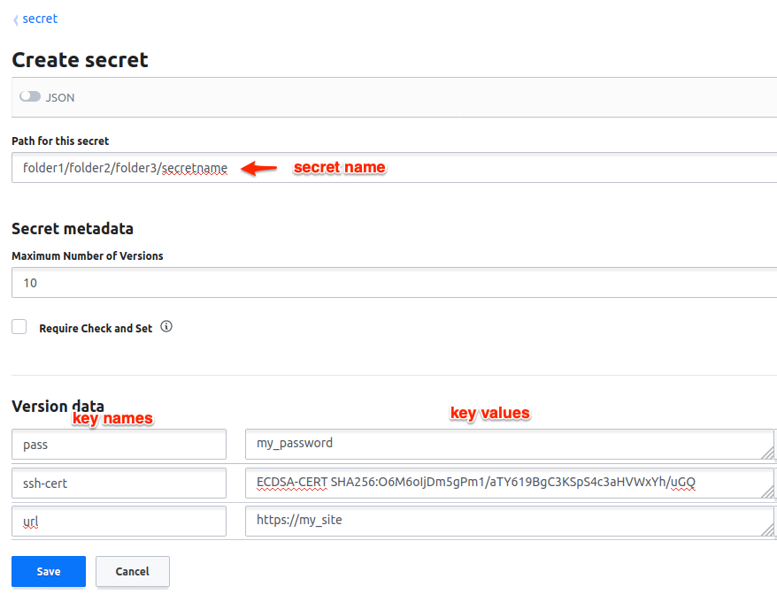

.. _secretManagement:

=================
Secret Management
=================

Requirements
============

Buildbot steps might need secrets to execute their actions.
Secrets are used to execute commands or to create authenticated network connections.
Secrets may be a SSH key, a password, or a file content like a wgetrc file or a public SSH key.
To preserve confidentiality, the secrets values must not be printed or logged in the twisted or steps logs.
Secrets must not be stored in the Buildbot configuration (master.cfg), as the source code is usually shared in SCM like git.

How to use Buildbot Secret Management
=====================================

Secrets and providers
---------------------

Buildbot implements several providers for secrets retrieval:

- File system based: secrets are written in a file.
  This is a simple solution for example when secrets are managed by config management system like Ansible Vault.

- Third party backend based: secrets are stored by a specialized software.
  These solution are usually more secured.

Secrets providers are configured if needed in the master configuration.
Multiple providers can be configured at once.
The secret manager is a Buildbot service.
The secret manager returns the specific provider results related to the providers registered in the configuration.

How to use secrets in Buildbot
------------------------------

Secret can be used in Buildbot via the :class:`~IRenderable` mechanism.
Two :class:`~IRenderable` actually implement secrets.
:ref:`Interpolate` can be used if you need to mix secrets and other interpolation in the same argument.
:ref:`Interpolate` can be used if your secret is directly used as a component argument.

.. _Secret:

Secret
``````
    :ref:`Secret` is a simple renderable which directly renders a secret.

    .. code-block:: python

        Secret("secretName")

As argument to steps
````````````````````
The following example shows a basic usage of secrets in Buildbot.

.. code-block:: python

    from buildbot.plugins import secrets, util
    # First we declare that the secrets are stored in a directory of the filesystem
    # each file contain one secret identified by the filename
    c['secretsProviders'] = [secrets.SecretInAFile(dirname="/path/toSecretsFiles")]

    # then in a buildfactory:

    # use a secret on a shell command via Interpolate
    f1.addStep(ShellCommand(
        util.Interpolate("wget -u user -p '%(secret:userpassword)s' '%(prop:urltofetch)s'")))
    # .. or non shell form:
    f1.addStep(ShellCommand(["wget", "-u", "user", "-p",
                             util.Secret("userpassword"),
                             util.Interpolate("%(prop:urltofetch)s")]))

Secrets are also interpolated in the build like properties are.
Their values will be used in a command line for example.

As argument to services
```````````````````````

You can use secrets to configure services.
All services arguments are not compatible with secrets.
See their individual documentation for details.

.. code-block:: python

    # First we declare that the secrets are stored in a directory of the filesystem
    # each file contain one secret identified by the filename
    c['secretsProviders'] = [secrets.SecretInAFile(dirname="/path/toSecretsFiles")]

    # then for a reporter:
    c['services'] = [GitHubStatusPush(token=util.Secret("githubToken"))]

Secrets storages
----------------

.. _SecretInAFile:

SecretInAFile
`````````````

.. code-block:: python

    c['secretsProviders'] = [secrets.SecretInAFile(dirname="/path/toSecretsFiles")]

In the passed directory, every file contains a secret identified by the filename.

e.g: a file ``user`` contains the text ``pa$$w0rd``.

Arguments:

``dirname``
  (required) Absolute path to directory containing the files with a secret.

``strip``
  (optional) if ``True`` (the default), trailing newlines are removed from the file contents.

.. _HashiCorpVaultSecretProvider:

HashiCorpVaultSecretProvider
````````````````````````````

.. code-block:: python

    c['secretsProviders'] = [secrets.HashiCorpVaultSecretProvider(
                            vaultToken=open('VAULT_TOKEN').read().strip(),
                            vaultServer="http://localhost:8200",
                            secretsmount="secret",
                            apiVersion=2
    )]

Vault secures, stores, and tightly controls access to secrets.
Vault presents a unified API to access multiple backends.
At the moment Buildbot supports KV v1 and v2 backends via the apiVersion argument.

Buildbot's Vault authentication/authorisation is via a token.
The "Initial Root Token", generated on Vault initialization, can be used but has ‘root’ authorization.
Vault policies, and subsequent tokens assigned to them, provide for a more restrictive approach.

In the master configuration, the Vault provider is instantiated through the Buildbot service manager as a secret provider with the Vault server address and the Vault token.
The provider SecretInVault allows Buildbot to read secrets in Vault.
For more information about Vault please visit: _`Vault`: https://www.vaultproject.io/

The secret identifiers that need to be passed to e.g. :ref:`Interpolate` accept one of the following
formats:

 - ``key``: The provider will fetch the secret with name ``key`` and return the value of ``value`` attribute stored therein.

 - ``key/attr``: The provider will fetch the secret with name ``key`` and return the value of ``attr`` attribute stored therein.

Vault stores secrets in form of key value pairs.

- Simple keys

.. image:: _images/vault_simple_key.png

The key value with key name ``keyname`` can be read like:

.. code-block:: python

    text = Interpolate("your key equals %(secret:folder1/folder2/secretname/keyname)s")

- Multipart keys



Each part of a multipart value can be read like

.. code-block:: python

    url = Interpolate("site url is %(secret: folder1/folde2/folde3/secretname/url)s")
    pass = Interpolate("your password is %(secret: folder1/folde2/folde3/secretname/pass)s")
    cert = Interpolate("your cert is %(secret: folder1/folde2/folde3/secretname/ssh-cert)s")


.. _SecretInPass:

SecretInPass
`````````````

.. code-block:: python

    c['secretsProviders'] = [secrets.SecretInPass(
                            gpgPassphrase="passphrase", 
                            dirname="/path/to/password/store"
    )]

Passwords can be stored in a unix password store, encrypted using GPG keys.
Buildbot can query secrets via the ``pass`` binary found in the PATH of each worker.
While ``pass`` allows for multiline entries, the secret must be on the first line of each entry.
The only caveat is that all passwords Buildbot needs to access have to be encrypted using the same GPG key.

For more information about ``pass``, please visit _`pass`: https://www.passwordstore.org/

Arguments:

``gpgPassphrase``
  (optional) Pass phrase to the GPG decryption key, if any

``dirname``
  (optional) Absolute path to the password store directory, defaults to ~/.password-store

How to populate secrets in a build
----------------------------------

To populate secrets in files during a build, 2 steps are used to create and delete the files on the worker.
The files will be automatically deleted at the end of the build.

.. code-block:: python

        f = BuildFactory()
        with f.withSecrets(secrets_list):
            f.addStep(step_definition)
 or

.. code-block:: python

        f = BuildFactory()
        f.addSteps([list_of_step_definitions], withSecrets=[secrets_list])

In both cases the secrets_list is a list of tuple (secret path, secret value).

.. code-block:: python

        secrets_list = [('/first/path', Interpolate('write something and %(secret:somethingmore)s')),
                        ('/second/path', Interpolate('%(secret:othersecret)s')]

The Interpolate class is used to render the value during the build execution.

How to configure a Vault instance
---------------------------------

Vault being a very generic system, it can be complex to install for the first time.
Here is a simple tutorial to install the minimal Vault to use with Buildbot.

Use Docker to install Vault
```````````````````````````

A Docker image is available to help users installing Vault.
Without any arguments, the command launches a Docker Vault developer instance, easy to use and test the functions.
The developer version is already initialized and unsealed.
To launch a Vault server please refer to the VaultDocker_ documentation:

.. _vaultDocker: https://hub.docker.com/_/vault/

In a shell:

.. code-block:: shell

    docker run vault

Starting the vault instance
```````````````````````````

Once the Docker image is created, launch a shell terminal on the Docker image:

.. code-block:: shell

      docker exec -i -t ``docker_vault_image_name`` /bin/sh

Then, export the environment variable VAULT_ADDR needed to init Vault.

.. code-block:: shell

      export VAULT_ADDR='vault.server.adress'

Writing secrets
```````````````

By default the official docker instance of Vault is initialized with a mount path of 'secret', a KV v1 secret engine, and a second KV engine (v2) at 'secret/data'.
Currently Buildbot is "hard wired" to expect KV v2 engines to reside within this "data" sub path.
Provision is made to set a top level path via the "secretsmount" argument: defaults to "secret".
To add a new secret:

.. code-block:: shell

      vault kv put secret/new_secret_key value=new_secret_value
