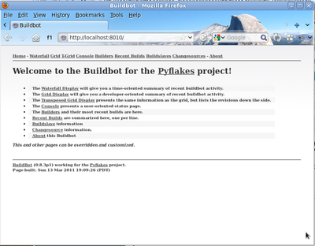

.. _first-run-docker-label:

==============================
First Buildbot run with Docker
==============================

Docker_ is an tool that makes building and deploying custom environments a breeze.
It uses lightweight linux containers (LXC) and performs quickly, making it a great instrument for the testing community.
The next section includes a Docker pre-flight check.
If it takes more that 3 minutes to get the 'Success' message for you, try the Buildbot pip-based :ref:`first run <getting-code-label>` instead.

.. _Docker: http://www.docker.io

Current Docker dependencies
---------------------------

* Linux system, with at least kernel 3.8 and AUFS support.
  For example, Standard Ubuntu, Debian and Arch systems.
* Packages: lxc, iptables, ca-certificates, and bzip2 packages
* Local clock on time or slightly in the future for proper SSL communication
* Download, launch and test docker is happy in your linux enviroment:

.. code-block:: bash

  mkdir tmp; cd tmp
  wget -O docker http://get.docker.io/builds/Linux/x86_64/docker-latest
  chmod 755 docker; sudo ./docker -d &
  sudo ./docker run -i busybox /bin/echo Success

Building and running Buildbot
-----------------------------

.. code-block:: bash

  # Download Buildbot Dockerfile.
  wget https://raw.github.com/buildbot/buildbot/master/master/contrib/Dockerfile

  # Build the Buildbot container (it will take a few minutes to download packages)
  sudo ./docker build -t buildbot - < Dockerfile

  # Run buildbot
  CONTAINER_ID=$(sudo ./docker run -d buildbot)

You should now be able to go to http://localhost:8010 and see a web page
similar to:

Click on the
`Waterfall Display link <http://localhost:8010/waterfall>`_
and you get this:

.. image:: _images/waterfall-empty.png
   :alt: empty waterfall.

Playing with your Buildbot container
------------------------------------

If you've come this far, you have a Buildbot environment that you can freely experiment with.
You can access your container using ssh  (username: admin, password: admin):

.. code-block:: bash

  ssh -p $(sudo ./docker port $CONTAINER_ID 22) admin@localhost

You've got a taste now, but you're probably curious for more.
Let's step it up a little in the second tutorial by changing the configuration and doing an actual build.
Continue on to :ref:`quick-tour-label`
