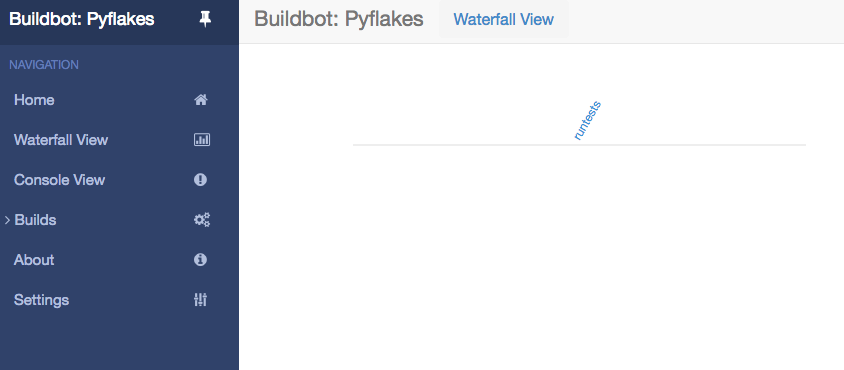

.. _first-run-label:

=========
First Run
=========

Goal
----

This tutorial will take you from zero to running your first buildbot master and worker as quickly as possible, without changing the default configuration.

This tutorial is all about instant gratification and the five minute experience: in five minutes we want to convince you that this project Works, and that you should seriously consider spending some more time learning the system.
In this tutorial no configuration or code changes are done.

This tutorial assumes that you are running on Unix, but might be adaptable easily to Windows.

Thanks to virtualenv_, installing buildbot in a standalone environment is very easy.
For those more familiar with Docker_, there also exists a :ref:`docker version of these instructions <first-run-docker-label>`.

You should be able to cut and paste each shell block from this tutorial directly into a terminal.

.. _Docker: https://docker.com

.. _getting-code-label:

Getting ready
-------------

There are many ways to get the code on your machine.
We will use here the easiest one: via ``pip`` in a virtualenv_.
It has the advantage of not polluting your operating system, as everything will be contained in the virtualenv.

To make this work, you will need the following installed:

* Python_ and the development packages for it
* virtualenv_

.. _Python: https://www.python.org/
.. _virtualenv: https://pypi.python.org/pypi/virtualenv

Preferably, use your distribution package manager to install these.

You will also need a working Internet connection, as virtualenv and pip will need to download other projects from the Internet.

.. note::

    Buildbot does not require root access.
    Run the commands in this tutorial as a normal, unprivileged user.

Creating a master
-----------------

The first necessary step is to create a virtualenv for our master.
All our operations will happen in this directory:

.. code-block:: bash

  cd
  mkdir tmp
  cd tmp
  virtualenv --no-site-packages bb-master
  cd bb-master

Now that we are ready, we need to install buildbot:

.. code-block:: bash

  ./bin/pip install buildbot[bundle]

Now that buildbot is installed, it's time to create the master:

.. code-block:: bash

  ./bin/buildbot create-master master
 
Buildbot's activity is controlled by a configuration file.
We will use the sample configuration file unchanged:

.. code-block:: bash
 
  mv master/master.cfg.sample master/master.cfg

Finally, start the master:

.. code-block:: bash

  ./bin/buildbot start master

You will now see some log information from the master in this terminal.
It should ends with lines like these:

.. code-block:: none

    2014-11-01 15:52:55+0100 [-] BuildMaster is running
    The buildmaster appears to have (re)started correctly.

From now on, feel free to visit the web status page running on the port 8010: http://localhost:8010/

Our master now needs (at least) a worker to execute its commands.
For that, heads on to the next section !

Creating a worker
-----------------

The worker will be executing the commands sent by the master.
In this tutorial, we are using the pyflakes project as an example.
As a consequence of this, your worker will need access to the git_ command in order to checkout some code.
Be sure that it is installed, or the builds will fail.

Same as we did for our master, we will create a virtualenv for our worker next to the other one.
It would however be completely ok to do this on another computer - as long as the *worker* computer is able to connect to the *master* one:

.. code-block:: bash

  cd
  cd tmp
  virtualenv --no-site-packages bb-worker
  cd bb-worker

Install the ``buildslave`` command:

.. code-block:: bash

   ./bin/pip install buildbot-slave

Now, create the worker:

.. code-block:: bash

  ./bin/buildslave create-slave worker localhost example-worker pass

.. note:: If you decided to create this from another computer, you should replace ``localhost`` with the name of the computer where your master is running.

The username (``example-worker``), and password (``pass``) should be the same as those in :file:`master/master.cfg`; verify this is the case by looking at the section for ``c['workers']``:

.. code-block:: bash

  cat master/master.cfg

And finally, start the worker:

.. code-block:: bash

  ./bin/buildslave start worker

Check the worker's output.
It should end with lines like these:

.. code-block:: none

  2014-11-01 15:56:51+0100 [-] Connecting to localhost:9989
  2014-11-01 15:56:51+0100 [Broker,client] message from master: attached
  The worker appears to have (re)started correctly.

Meanwhile, from the other terminal, in the master log (:file:``twisted.log`` in the master directory), you should see lines like these:

.. code-block:: none

  2014-11-01 15:56:51+0100 [Broker,1,127.0.0.1] worker 'example-worker' attaching from IPv4Address(TCP, '127.0.0.1', 54015)
  2014-11-01 15:56:51+0100 [Broker,1,127.0.0.1] Got workerinfo from 'example-worker'
  2014-11-01 15:56:51+0100 [-] bot attached

You should now be able to go to http://localhost:8010, where you will see a web page similar to:

.. image:: _images/index.png
   :alt: index page

Click on the `Waterfall Display link <http://localhost:8010/waterfall>`_ and you get this:

Your master is now quietly waiting for new commits to Pyflakes.
This doesn't happen very often though.
In the next section, we'll see how to manually start a build.

We just wanted to get you to dip your toes in the water.
It's easy to take your first steps, but this is about as far as we can go without touching the configuration.

You've got a taste now, but you're probably curious for more.
Let's step it up a little in the second tutorial by changing the configuration and doing an actual build.
Continue on to :ref:`quick-tour-label`.

.. _git: http://git-scm.com/
