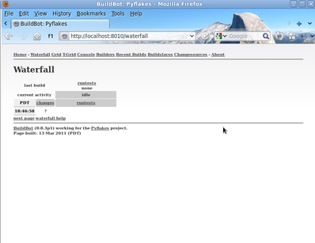

.. _first-run-label:

=========
First Run
=========

Goal
----

This tutorial will take you from zero to running your first buildbot master and slave as quickly as possible, without changing the default configuration.

This tutorial is all about instant gratification and the five minute experience: in five minutes we want to convince you that this project Works, and that you should seriously consider spending some more time learning the system.
In this tutorial no configuration or code changes are done.

This tutorial assumes that you are running on Unix, but might be adaptable easily to Windows.

For the :ref:`fastest way through in Linux <first-run-docker-label>`, you can use Docker, the linux container engine.
Docker automates all the deployment steps for you.

For a more manual approach, you should be able to cut and paste each shell block from this tutorial directly into a terminal.

.. _getting-code-label:

Getting the code
----------------

There are many ways to get the code on your machine.
For this tutorial, we will use easy_install to install and run buildbot.
While this isn't the preferred method to install buildbot, it is the simplest one to use for the purposes of this tutorial because it should work on all systems.
(The preferred method would be to install buildbot via ``pip``.)

To make this work, you will need the following installed:
* Python_ and the development packages for it
* virtualenv_
* Git_

.. _Python: http://www.python.org/
.. _virtualenv: http://pypi.python.org/pypi/virtualenv/
.. _Git: http://git-scm.com/

Preferably, use your package installer to install these.

You will also need a working Internet connection, as virtualenv and easy_install will need to download other projects from the Internet.

.. note::

    Buildbot does not require root access.
    Run the commands in this tutorial as a normal, unprivileged user.

Let's dive in by typing at the terminal:

.. code-block:: bash

  cd
  mkdir -p tmp/buildbot
  cd tmp/buildbot
  virtualenv --no-site-packages sandbox
  source sandbox/bin/activate
  easy_install sqlalchemy==0.7.10
  easy_install buildbot

.. note::

    The requirement to install SQLAlchemy-0.7.10 is due to a conflict between newer versions of SQLAlchemy and SQLAlchemy-Migrate.

Creating a master
-----------------

At the terminal, type:

.. code-block:: bash

  buildbot create-master master
  mv master/master.cfg.sample master/master.cfg

Now start it:

.. code-block:: bash

  buildbot start master
  tail -f master/twistd.log

You will now see all of the log information from the master in this terminal.
You should see lines like this:

.. code-block:: none

    2011-12-04 10:04:40-0600 [-] Starting factory <buildbot.status.web.baseweb.RotateLogSite instance at 0x2e36638>
    2011-12-04 10:04:40-0600 [-] Setting up http.log rotating 10 files of 10000000 bytes each
    2011-12-04 10:04:40-0600 [-] WebStatus using (/home/dustin/tmp/buildbot/master/public_html)
    2011-12-04 10:04:40-0600 [-] removing 0 old schedulers, updating 0, and adding 1
    2011-12-04 10:04:40-0600 [-] adding 1 new changesources, removing 0
    2011-12-04 10:04:40-0600 [-] gitpoller: using workdir '/home/dustin/tmp/buildbot/master/gitpoller-workdir'
    2011-12-04 10:04:40-0600 [-] gitpoller: initializing working dir from git://github.com/buildbot/pyflakes.git
    2011-12-04 10:04:40-0600 [-] configuration update complete
    2011-12-04 10:04:41-0600 [-] gitpoller: checking out master
    2011-12-04 10:04:41-0600 [-] gitpoller: finished initializing working dir from git://github.com/buildbot/pyflakes.git at rev 1a4af6ec1dbb724b884ea14f439b272f30439e4d

Creating a slave
----------------

Open a new terminal and enter the same sandbox you created before:

.. code-block:: bash

  cd
  cd tmp/buildbot
  source sandbox/bin/activate

Install the ``buildslave`` command:

.. code-block:: bash

   easy_install buildbot-slave

Now, create the slave:

.. code-block:: bash

  buildslave create-slave slave localhost:9989 example-slave pass

The user:host pair, username, and password should be the same as the ones in master.cfg; verify this is the case by looking at the section for ``c['slaves']`` and ``c['slavePortnum']``:

.. code-block:: bash

  cat master/master.cfg

Now, start the slave:

.. code-block:: bash

  buildslave start slave

Check the slave's log:

.. code-block:: bash

  tail -f slave/twistd.log

You should see lines like the following at the end of the worker log:

.. code-block:: none

  2009-07-29 20:59:18+0200 [Broker,client] message from master: attached
  2009-07-29 20:59:18+0200 [Broker,client] SlaveBuilder.remote_print(buildbot-full): message from master: attached
  2009-07-29 20:59:18+0200 [Broker,client] sending application-level keepalives every 600 seconds

Meanwhile, in the other terminal, in the master log, if you tail the log you should see lines like this:

.. code-block:: none

  2011-03-13 18:46:58-0700 [Broker,1,127.0.0.1] slave 'example-slave' attaching from IPv4Address(TCP, '127.0.0.1', 41306)
  2011-03-13 18:46:58-0700 [Broker,1,127.0.0.1] Got slaveinfo from 'example-slave'
  2011-03-13 18:46:58-0700 [Broker,1,127.0.0.1] bot attached
  2011-03-13 18:46:58-0700 [Broker,1,127.0.0.1] Buildslave example-slave attached to runtests

You should now be able to go to http://localhost:8010, where you will see a web page similar to:

.. image:: _images/index.png
   :alt: index page

Click on the `Waterfall Display link <http://localhost:8010/waterfall>`_ and you get this:

That's the end of the first tutorial.
A bit underwhelming, you say?
Well, that was the point!
We just wanted to get you to dip your toes in the water.
It's easy to take your first steps, but this is about as far as we can go without touching the configuration.

You've got a taste now, but you're probably curious for more.
Let's step it up a little in the second tutorial by changing the configuration and doing an actual build.
Continue on to :ref:`quick-tour-label`.
