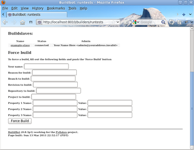
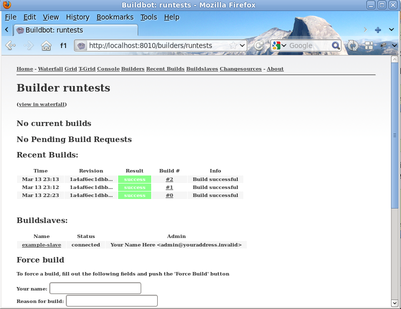

.. _quick-tour-label:

============
A Quick Tour
============

Goal
----

This tutorial will expand on the :ref:`first-run-label` tutorial by taking a quick tour around some of the features of buildbot that are hinted at in the comments in the sample configuration.
We will simply change parts of the default configuration and explain the activated features.

As a part of this tutorial, we will make buildbot do a few actual builds.

This section will teach you how to:

- make simple configuration changes and activate them
- deal with configuration errors
- force builds
- enable and control the IRC bot
- add a 'try' scheduler

The First Build
---------------

On the `Builders <http://localhost:8010/#/builders>`_ page, click on the runtests link.
You'll see a builder page, and a blue "force" button that will bring up the
following dialog box:

Click *Start Build* - there's no need to fill in any of the fields in this case.
Next, click on `view in waterfall <http://localhost:8010/#/waterfall?show=runtests>`_.

You will now see that a successful test run has happened:

.. image:: _images/runtests-success.png
   :alt: an successful test run happened.

This simple process is essentially is the whole purpose of the Buildbot project.

The information about what actions are executed for a certain build are defined in things called :ref:`builders <Concepts-Builder>`.

The information about when a certain builder should launch a build are defined in things called :ref:`schedulers <Concepts-Scheduler>`.
In fact, the blue "force" button that was pushed in this example activated a scheduler too.

Setting Project Name and URL
----------------------------

Let's start simple by looking at where you would customize the buildbot's project name and URL.

We continue where we left off in the :ref:`first-run-label` tutorial.

Open a new terminal, go to the directory you created master in, activate the same virtualenv instance you created before, and open the master configuration file with an editor (here ``$EDITOR`` is your editor of choice like vim, gedit, or emacs):

.. code-block:: bash

  cd ~/buildbot-test/master
  source sandbox/bin/activate
  $EDITOR master/master.cfg

Now, look for the section marked *PROJECT IDENTITY* which reads::

  ####### PROJECT IDENTITY

  # the 'title' string will appear at the top of this buildbot installation's
  # home pages (linked to the 'titleURL').

  c['title'] = "Hello World CI"
  c['titleURL'] = "https://buildbot.github.io/hello-world/"

If you want, you can change either of these links to anything you want to see what happens when you change them.

After making a change go into the terminal and type:

.. code-block:: bash

  buildbot reconfig master

You will see a handful of lines of output from the master log, much like this:

.. code-block:: none

    2011-12-04 10:11:09-0600 [-] loading configuration from /path/to/buildbot/master.cfg
    2011-12-04 10:11:09-0600 [-] configuration update started
    2011-12-04 10:11:09-0600 [-] builder runtests is unchanged
    2011-12-04 10:11:09-0600 [-] removing IStatusReceiver <...>
    2011-12-04 10:11:09-0600 [-] (TCP Port 8010 Closed)
    2011-12-04 10:11:09-0600 [-] Stopping factory <...>
    2011-12-04 10:11:09-0600 [-] adding IStatusReceiver <...>
    2011-12-04 10:11:09-0600 [-] RotateLogSite starting on 8010
    2011-12-04 10:11:09-0600 [-] Starting factory <...>
    2011-12-04 10:11:09-0600 [-] Setting up http.log rotating 10 files of 10000000 bytes each
    2011-12-04 10:11:09-0600 [-] WebStatus using (/path/to/buildbot/public_html)
    2011-12-04 10:11:09-0600 [-] removing 0 old schedulers, updating 0, and adding 0
    2011-12-04 10:11:09-0600 [-] adding 1 new changesources, removing 1
    2011-12-04 10:11:09-0600 [-] gitpoller: using workdir '/path/to/buildbot/gitpoller-workdir'
    2011-12-04 10:11:09-0600 [-] GitPoller repository already exists
    2011-12-04 10:11:09-0600 [-] configuration update complete

    Reconfiguration appears to have completed successfully.

The important lines are the ones telling you that it is loading the new configuration at the top, and the one at the bottom saying that the update is complete.

Now, if you go back to `the waterfall page <http://localhost:8010/#/waterfall>`_, you will see that the project's name is whatever you may have changed it to and when you click on the URL of the project name at the bottom of the page it should take you to the link you put in the configuration.

Configuration Errors
--------------------

It is very common to make a mistake when configuring buildbot, so you might as well see now what happens in that case and what you can do to fix the error.

Open up the config again and introduce a syntax error by removing the first single quote in the two lines you changed, so they read:

..
    Format a `none` since this is not a valid Python code

.. code-block:: none

  c[title'] = "Hello World CI"
  c[titleURL'] = "https://buildbot.github.io/hello-world/"

This creates a Python ``SyntaxError``.
Now go ahead and reconfig the buildmaster:

.. code-block:: bash

  buildbot reconfig master

This time, the output looks like:

.. code-block:: none

    2015-08-14 18:40:46+0000 [-] beginning configuration update
    2015-08-14 18:40:46+0000 [-] Loading configuration from '/data/buildbot/master/master.cfg'
    2015-08-14 18:40:46+0000 [-] error while parsing config file:
	    Traceback (most recent call last):
	      File "/usr/local/lib/python2.7/dist-packages/buildbot/master.py", line 265, in reconfig
		d = self.doReconfig()
	      File "/usr/local/lib/python2.7/dist-packages/twisted/internet/defer.py", line 1274, in unwindGenerator
		return _inlineCallbacks(None, gen, Deferred())
	      File "/usr/local/lib/python2.7/dist-packages/twisted/internet/defer.py", line 1128, in _inlineCallbacks
		result = g.send(result)
	      File "/usr/local/lib/python2.7/dist-packages/buildbot/master.py", line 289, in doReconfig
		self.configFileName)
	    --- <exception caught here> ---
	      File "/usr/local/lib/python2.7/dist-packages/buildbot/config.py", line 156, in loadConfig
		exec f in localDict
	    exceptions.SyntaxError: EOL while scanning string literal (master.cfg, line 103)

    2015-08-14 18:40:46+0000 [-] error while parsing config file: EOL while scanning string literal (master.cfg, line 103) (traceback in logfile)
    2015-08-14 18:40:46+0000 [-] reconfig aborted without making any changes

    Reconfiguration failed. Please inspect the master.cfg file for errors,
    correct them, then try 'buildbot reconfig' again.

This time, it's clear that there was a mistake in the configuration.
Luckily, the Buildbot master will ignore the wrong configuration and keep running with the previous configuration.

The message is clear enough, so open the configuration again, fix the error, and reconfig the master.

Enabling the IRC Bot
--------------------

Buildbot includes an IRC bot that you can tell to join a channel and control to report on the status of buildbot.

.. note:: Security Note

    Please note that any user having access to your irc channel or can send the private message to the bot will be able to create or stop builds :bug:`3377`.

First, start an IRC client of your choice, connect to irc.freenode.net and join an empty channel.
In this example we will use ``#buildbot-test``, so go join that channel.
(*Note: please do not join the main buildbot channel!*)

Edit :file:`master.cfg` and look for the *BUILDBOT SERVICES* section.
At the end of that section add the lines::

  c['services'].append(reporters.IRC(host="irc.freenode.net", nick="bbtest",
                                     channels=["#buildbot-test"]))

Reconfigure the build master then do:

.. code-block:: bash

  grep -i irc master/twistd.log

The log output should contain a line like this:

.. code-block:: none

  2016-11-13 15:53:06+0100 [-] Starting factory <...>
  2016-11-13 15:53:19+0100 [IrcStatusBot,client] <...>: I have joined #buildbot-test

You should see the bot now joining in your IRC client.
In your IRC channel, type:

.. code-block:: none

  bbtest: commands

to get a list of the commands the bot supports.

Let's tell the bot to notify certain events, to learn which EVENTS we can notify on:

.. code-block:: none

  bbtest: help notify

Now let's set some event notifications:

.. code-block:: irc

  <@lsblakk> bbtest: notify on started finished failure
  < bbtest> The following events are being notified: ['started', 'failure', 'finished']

Now, go back to the web interface and force another build. Alternatively, ask the bot to force a build:

.. code-block:: irc

  <@lsblakk> bbtest: force build --codebase= runtests
  < bbtest> build #1 of runtests started
  < bbtest> Hey! build runtests #1 is complete: Success [finished]

You can also see the new builds in the web interface.

The full documentation is available at :bb:reporter:`IRC`.

Setting Authorized Web Users
----------------------------

The default configuration allows everyone to perform any task like creating or stopping builds via the web interface. To restrict this to a user, look for::

  c['www'] = dict(port=8010,
                   plugins=dict(waterfall_view={}, console_view={}))

and append::

  c['www']['authz'] = util.Authz(
          allowRules = [
              util.AnyEndpointMatcher(role="admins")
          ],
          roleMatchers = [
              util.RolesFromUsername(roles=['admins'], usernames=['Alice'])
          ]
  )
  c['www']['auth'] = util.UserPasswordAuth([('Alice','Password1')])

For more details, see :ref:`Web-Authentication`.

Adding a 'try' scheduler
------------------------

Buildbot includes a way for developers to submit patches for testing without committing them to the source code control system.
(This is really handy for projects that support several operating systems or architectures.)

To set this up, add the following lines to master.cfg::

  from buildbot.scheduler import Try_Userpass
  c['schedulers'] = []
  c['schedulers'].append(Try_Userpass(
                                      name='try',
                                      builderNames=['runtests'],
                                      port=5555,
                                      userpass=[('sampleuser','samplepass')]))

Then you can submit changes using the :bb:cmdline:`try` command.

Let's try this out by making a one-line change to hello-world, say, to make it trace the tree by default:

.. code-block:: bash

  git clone https://github.com/buildbot/hello-world.git hello-world-git
  cd hello-world-git/hello
  $EDITOR __init__.py
  # change 'return "hello " + who' on line 6 to 'return "greets " + who'

Then run buildbot's ``try`` command as follows:

.. code-block:: bash

    cd ~/buildbot-test/master
    source sandbox/bin/activate
    buildbot try --connect=pb --master=127.0.0.1:5555 \
        --username=sampleuser --passwd=samplepass --vc=git

This will do ``git diff`` for you and send the resulting patch to the server for build and test against the latest sources from Git.

Now go back to the `waterfall <http://localhost:8010/#/waterfall>`_ page, click on the runtests link, and scroll down.
You should see that another build has been started with your change (and stdout for the tests should be chock-full of parse trees as a result).
The "Reason" for the job will be listed as "'try' job", and the blamelist will be empty.

To make yourself show up as the author of the change, use the ``--who=emailaddr`` option on ``buildbot try`` to pass your email address.

To make a description of the change show up, use the ``--properties=comment="this is a comment"`` option on ``buildbot try``.

To use ssh instead of a private username/password database, see :bb:sched:`Try_Jobdir`.
